[English](README.md) · [한국어](README.ko.md) · [中文](README.zh-cn.md)

# image-generation-qwen-image-2.1

텍스트 프롬프트로 그림을 만들고, 레퍼런스 사진을 넣으면 그 인물·상품을 새 장면에 넣거나 사진을 고쳐 주는 서비스다.

텍스트→이미지와 편집을 한 모델로 하는 Qwen-Image-2.1을 model-compose로 띄워 NVIDIA DGX Spark와 RTX 4090에서 실행했다. 이 모델이 내 기기에서 돌아가는지, 돌아가면 무엇을 잘하고 못하는지를 봤고, 다른 모델과 비교하지는 않았다. Apple M2 16GB는 원본 가중치가 들어가지 않아, 제3자가 4비트로 줄인 가중치로 돌아가는지만 확인했다. 문구, 레퍼런스, 보정 결과는 작성자 1인이 눈으로 판정했고, 글자 오류율과 레퍼런스 유사도를 수치로 함께 쟀다.

## 목차

- [빠른 시작](#빠른-시작)
- [요약](#요약)
- [1 실험 환경](#1-실험-환경)
- [2 내 기기에서 돌아가는가](#2-내-기기에서-돌아가는가)
- [3 기능별 결과](#3-기능별-결과)
  - [3.1 글자 렌더링](#31-글자-렌더링)
  - [3.2 레퍼런스 1장을 새 장면에 넣기](#32-레퍼런스-1장을-새-장면에-넣기)
  - [3.3 레퍼런스 여러 장을 한 장면에](#33-레퍼런스-여러-장을-한-장면에)
  - [3.4 사진 보정](#34-사진-보정)
  - [3.5 투명 배경](#35-투명-배경)
  - [3.6 패션 룩북](#36-패션-룩북)
- [4 권고](#4-권고)
- [5 한계와 측정하지 않은 것](#5-한계와-측정하지-않은-것)
- [라이선스](#라이선스)

## 모델

[`Qwen/Qwen-Image-2.1`](https://huggingface.co/Qwen/Qwen-Image-2.1)은 텍스트→이미지 생성과 사진 편집을 모델 하나로 하는 공개 이미지 모델이다.
레퍼런스 이미지를 최대 10장까지 받고, 그림 안에 글자를 쓰며, 투명 배경(RGBA) 그림도 만든다.

## 데모

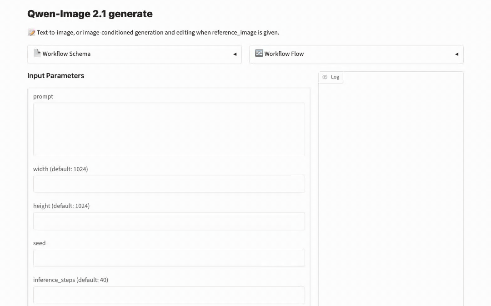

## 빠른 시작

[model-compose](https://github.com/hanyeol/model-compose) 0.4.111 이상이 필요하다.

[uv](https://docs.astral.sh/uv/)로 설치:

```bash
uv pip install model-compose
```

또는 pip로 설치:

```bash
pip install model-compose
```

이 저장소 클론:

```bash
git clone https://github.com/MindrLabs/image-generation-qwen-image-2.1
cd image-generation-qwen-image-2.1
```

실행:

```bash
model-compose up
```

gradio 화면은 `http://localhost:8081`, HTTP API는 `http://localhost:8080/api`에서 열린다.
`SERVER_PORT`와 `PORT`로 각 포트를 바꾼다.

| 첫 실행 | 하는 일 |
| :---: | --- |
| 가상 환경 | model-compose가 `.venv/qwen-image`에 환경을 만들고 torch와 diffusers main을 설치한다 |
| 체크포인트 | `Qwen/Qwen-Image-2.1` 33 GB를 내려받는다. 토큰은 필요 없고 `HF_TOKEN`은 다운로드 제한만 높인다 |

`DEVICE` 기본값은 `auto`다. NVIDIA GPU면 CUDA, 맥이면 MPS를 고른다.
`cpu_offload: model`이 켜져 있어 24 GB GPU에서도 돈다. 시스템 RAM을 50 GB 이상 비워 둔다. 이 설정은 CUDA에서만 적용된다.
40 GB 이상 GPU에서는 `cpu_offload`를 지우면 더 빠르다. DGX Spark에서 이 설정 그대로 레퍼런스 1장을 넣은 1024²·40스텝 한 장이 약 4분 20초 걸렸고, 지우면 62.5초다. 아래 DGX Spark 수치는 이 설정 없이 쟀다.
16 GB 맥에는 원본 가중치가 들어가지 않는다. 컴포넌트의 `model`을 제3자 4비트 변환본으로 바꾼다:

```yaml
  model:
    provider: huggingface
    repository: circulus/Qwen-Image-2.1-bnb-4bit
    token: ${env.HF_TOKEN | }
  quantization:
    type: nf4
    compute_dtype: bfloat16
    double_quant: false
```

`max_concurrent_count: 1`이므로 두 번째 요청은 첫 요청이 끝날 때까지 기다린다.

요청 예:

```bash
curl -o out.png localhost:8080/api/workflows/runs \
  -F workflow_id=generate -F wait_for_completion=true -F output_only=true \
  -F "input.prompt=A poster that says HELLO in bold letters" -F input.seed=42 \
  -F input.width=1024 -F input.height=1024 -F input.inference_steps=40
```

## 요약

1. DGX Spark에서 1024² 한 장은 40스텝 54초, 20스텝 28초가 걸렸다. 공식 권장 설정(2048², 40스텝)은 4분 16초였다. 16GB 맥은 원본(33 GB)이 들어가지 않지만, 4비트 변환본(11.4 GB)으로는 돌아간다. 1024²·20스텝 한 장에 19분이 걸린다.
2. 그림 안에 써 달라고 한 영어와 중국어는 거의 틀리지 않았다. 한국어는 짧은 문구는 정확했지만, 손글씨와 메뉴 카드에서는 한 글자의 받침이나 모음이 바뀌었다. 어떤 글자가 틀릴지는 문구가 정해서, seed나 기기를 바꿔도 같은 글자가 같은 모양으로 틀리고 단어를 바꿔야 고쳐진다. 7줄 공책 손글씨는 세 언어 모두 흔들렸다. 요청하지 않은 배경 글자는 모두 가짜 글자다.
3. 레퍼런스 1장을 새 장면에 넣으면 인물과 상품이 잘 유지된다. 레퍼런스가 이 모델로 만든 그림이라면 그 그림을 만든 seed를 다시 쓰지 말아야 한다. 그 seed에서는 새 장면 대신 레퍼런스를 과포화된 채로 베꼈고, 다른 seed는 모두 새 장면을 만들었다. 사진 보정도 마찬가지여서, 다른 seed에서는 배경 바꾸기와 색 보정이 깔끔했다. 사진에 원을 그리거나 색을 칠해 고칠 곳을 알려 주는 편집도 됐다.
4. 레퍼런스 10장을 한 장면에 넣으면 열 개가 모두 들어가지만 일부는 덜 닮는다(유지 6, 부분 4). 한 장에 약 10분이 걸렸다.
5. 일부 그림에서 고정된 위치에 옅은 분홍 세로선이 생긴다. 설정을 바꿔도 사라지지 않아 모델 쪽 결함으로 본다.

표 1: 기기별 요약

| 기기 | 돌아가나 | 1024² 40스텝 한 장 | 메모리 |
|---|---|---|---|
| Apple M2 16GB | 4비트 변환본으로 돌아간다 | 재지 않았다(20스텝 19분) | 13 GB(레퍼런스 1장이면 17 GB, 스왑 발생) |
| RTX 4090 24GB | 돌아간다(CPU 오프로드 필요) | 약 45초(손으로 보낸 3건) | VRAM 19.8 GB, 시스템 RAM 45 GB |
| DGX Spark | 돌아간다 | 54초 | 31.6 GB |

## 1 실험 환경

표 2: 측정 기기

| 기기 | 가속기 | 메모리 | 조건 |
|---|---|---|---|
| DGX Spark | GB10, 드라이버 580.126.09, CUDA 13.0 | 120 GB 통합 | 공용. 남은 메모리가 약 93 GB일 때 쟀다 |
| RTX 4090 워크스테이션 | RTX 4090 1장 | 24 GB | `cpu_offload: model` |
| MacBook(Apple M2) | MPS | 16 GB 통합 | 브라우저를 닫고 쟀다. 시작 전부터 스왑 4 GB가 쓰이고 있었다 |

- 소프트웨어: model-compose upstream `5e82e0e3`(2026-09-21), diffusers 0.41.0.dev0, transformers 5.17.0, bf16이다. torch는 DGX가 2.13.0 cu130(aarch64), 4090이 2.14.0 cu126, Mac이 2.14.0(MPS)이다. Mac만 bitsandbytes 0.50.2를 더 썼다.
- 가중치는 `Qwen/Qwen-Image-2.1` 리비전 `790c9263`이다. Mac만 제3자 4비트(nf4) 변환본 `circulus/Qwen-Image-2.1-bnb-4bit`를 썼다.
- DGX의 텍스트→이미지 속도는 조건마다 같은 seed(42)로 2회씩 돌려 쟀고, 서버를 띄운 뒤 첫 요청은 뺐다.
- 레퍼런스·보정·4090 수치는 서버에 직접 보낸 요청으로 쟀다.
- 수치 지표: 글자는 Qwen2.5-VL-7B로 읽어 글자 오류율(CER)을 쟀다. 레퍼런스와의 유사도는 코사인으로, 인물은 InsightFace(antelopev2), 상품은 상품 부분만 잘라 DINOv2-base로 쟀다.
- 기본 설정은 1024², 40스텝, `true_cfg_scale` 1.0(CFG 꺼짐)이다. CFG는 그림이 프롬프트를 더 강하게 따르게 하는 설정으로, 켜면 스텝마다 계산을 두 번 해서 느려진다.
- 레퍼런스는 모두 이 모델로 먼저 만든 가상 인물과 상품이다. 실존 인물 사진은 쓰지 않았다.

4090과 DGX는 가중치와 정밀도(bf16)가 같아 품질 판정을 섞어도 된다고 봤다. 다만 seed가 같아도 기기가 다르면 다른 그림이 나오므로, 그림을 다시 만들려면 각 그림과 표에 적힌 기기에서 돌려야 한다.

## 2 내 기기에서 돌아가는가

표 3: DGX Spark 장당 생성 시간(중앙값, 서버 경유)

| 해상도 | 20스텝 | 40스텝 | 최대 메모리 |
|---|---|---|---|
| 1024² | 28.3초 | 54.1초 | 31.6 GB |
| 2048² (공식 권장) | 2분 14초 | 4분 16초 | 33.7 GB |

**스텝과 seed.** 이 모델은 무작위 노이즈에서 시작해 노이즈를 조금씩 걷어 내며 그림을 만든다. 한 번 걷어 내는 과정이 1스텝이다. 스텝이 많을수록 느리지만 세부가 살아난다. 시간은 스텝 수에 거의 비례하고, 기본값은 40이다. seed는 시작 노이즈를 정하는 번호다. 같은 기기에서 같은 seed를 주면 완전히 같은 그림이 나온다. DGX에서는 모든 조건에서 두 번 만든 파일이 바이트까지 같았다. 기기가 다르면 seed가 같아도 다른 그림이 나온다.

- 해상도를 두 배(픽셀 네 배)로 올리면 약 4.7배 오래 걸린다.
- 서버를 띄워 모델을 올리는 데 약 3분이 걸린다.
- 같은 조건의 반복은 거의 흔들리지 않았다(1024²·20스텝 4장이 28.2\~28.3초).

표 4: 레퍼런스 장수별 생성 시간(1024², 40스텝)

| 레퍼런스 | DGX Spark | RTX 4090 |
|---|---|---|
| 없음 | 54초 | 약 45초(3건) |
| 1장 | 62.5초 | 48.5초(8건) |
| 3장 | 184초 | 재지 않았다 |
| 10장 | 598초 | 재지 않았다 |

- **RTX 4090**: 20스텝은 35초, CFG를 켜면(`true_cfg_scale` 4) 65초였다. 요청 몇 건으로 잰 값이라 반복 측정만큼 정확하지 않다.

### CPU 오프로드와 메모리

24 GB GPU에서 돌아가는 것은 CPU 오프로드 덕분이다. 대신 그만큼을 시스템 RAM에서 가져간다.

오프로드는 가중치를 평소 CPU 메모리에 두고 계산할 차례가 온 것만 GPU로 옮기는 방식이다.

**`cpu_offload: model`은 텍스트 인코더, 그림 모델, VAE를 통째로 하나씩 올렸다 내린다.** 그래서 VRAM은 가장 큰 덩어리 하나 크기로 줄고, 가중치 전부는 시스템 RAM에 남는다. 옮기는 일이 스텝마다가 아니라 단계마다 한 번씩이라 속도 손해도 작다. 4090이 오프로드를 켜고도 DGX보다 빨랐던 것은 메모리 대역폭(1,008 GB/s 대 273 GB/s)과 연산 성능이 더 높아서로 보인다.

표 5: 설정별 메모리

| 기기와 설정 | GPU 메모리 | 시스템 RAM |
|---|---|---|
| RTX 4090 24GB, `cpu_offload: model` | 19.8 GB | 워커 프로세스가 45 GB |
| DGX Spark, 오프로드 없음 | 통합 메모리 31.6 GB | 통합이라 같은 메모리다 |
| Apple M2 16GB, 4비트 | 통합 메모리 13 GB(레퍼런스 1장이면 17 GB) | 같은 메모리, 스왑 10\~12 GB |

### 스텝을 줄이면 무엇을 잃나

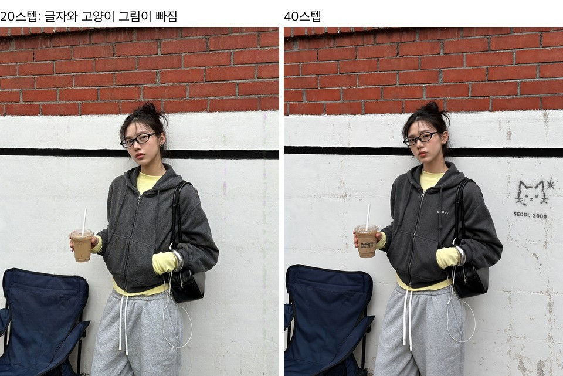

그림 1(DGX): 같은 프롬프트와 seed(42), 20스텝(왼쪽)과 40스텝(오른쪽).

| 장면 | 20스텝 | 40스텝 |
|---|---|---|
| 커피잔과 크루아상 | 구도와 질감이 40스텝과 거의 같다 | 조금 더 선명하다 |
| 서울 골목 스트리트 스냅 | 구도, 인물, 옷은 같다. 프롬프트의 컵 슬리브 글자 "MANGWON ROASTERS", 가슴의 "SEOUL", 벽의 고양이 그림이 모두 빠졌다 | 세 요소가 모두 나온다 |
| 패션 룩북(2048×1152, 그림 2) | 구도, 포즈, 옷 모양은 같다. 톱의 구김과 스커트 매듭 주변 셔링이 적어 천이 매끈하다 | 구김과 셔링이 더 많고 선명하다 |

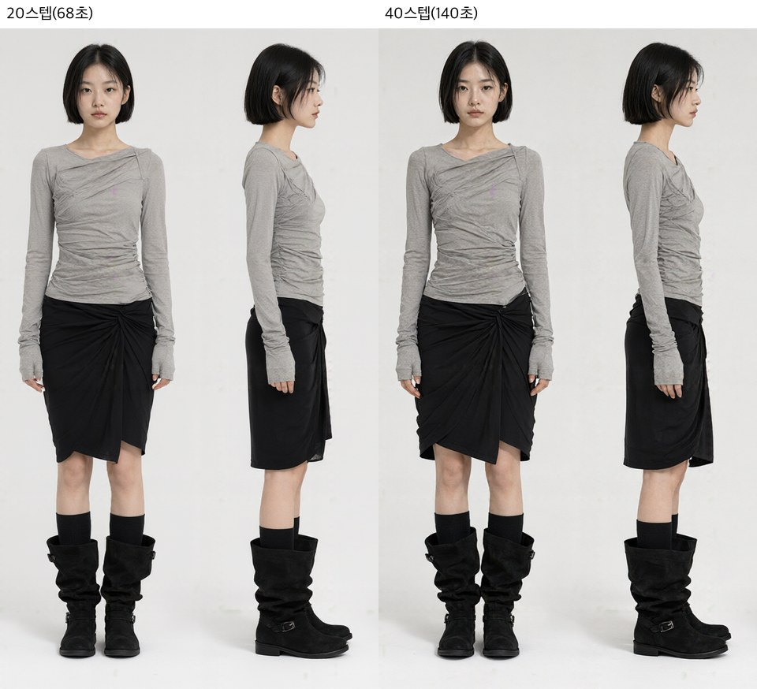

그림 2(DGX): 같은 seed(7) 룩북의 앞·옆 전신. 20스텝(왼쪽)은 68초, 40스텝(오른쪽)은 140초가 걸렸다.

20스텝은 시간이 절반이다. 구도는 같아도 글자나 작은 그림 같은 프롬프트 요소가 빠질 수 있고, 옷처럼 질감이 중요한 그림에서는 주름 같은 세부가 줄어든다.

### 16GB 맥에서는 4비트로 돌아간다

원본 가중치를 4비트로 줄이면 33 GB가 11.4 GB가 된다(텍스트 인코더 6.7, 그림 모델 4.0, VAE 0.7). 이 변환본을 model-compose로 띄웠다.

표 6: Apple M2 16GB와 DGX Spark 비교(1024², 20스텝, seed 42, 한 장씩)

| 작업 | Mac 4비트 | DGX 원본 | Mac 메모리 |
|---|---|---|---|
| 텍스트→이미지 | 1142초(19분) | 31초 | 13 GB |
| 레퍼런스 1장 | 1627초(27분) | 35초 | 17 GB |
| 참고: 512² 텍스트→이미지 | 226초(4분) | 재지 않았다 | 13 GB |

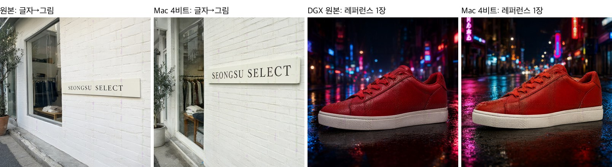

그림 3: 텍스트→이미지(1·2번째)와 레퍼런스 1장(3·4번째)을 원본과 Mac 4비트로 비교했다. 간판 쌍은 4090 원본(36초)과 Mac 4비트(1011초), 운동화 쌍은 DGX 원본과 Mac 4비트다. 기기가 다르면 seed가 같아도 구도가 달라진다.

- **글자는 두 기기 모두 정확했다.** 편집샵 간판의 영어 "SEONGSU SELECT"를 원본과 Mac 4비트 모두 열세 글자 그대로 썼고, 확대해도 획이 깨지지 않았다. 4비트로 줄여도 큰 글자 한 줄은 견딘다. 다만 한 장씩이라 어려운 문구까지 견디는지는 알 수 없다.
- 운동화는 두 기기 모두 밑창, 끈, 가죽 질감이 레퍼런스와 거의 같았다.
- **느린 까닭은 메모리다.** 모델이 13 GB를 쓰고, 레퍼런스를 넣으면 17 GB로 늘어 RAM 16 GB를 넘는다. 스왑이 약 10\~12 GB까지 올라갔다. 한 스텝에 텍스트→이미지는 약 55초, 레퍼런스 1장은 약 78초가 걸렸다.
- [upstream 이슈 #6](https://github.com/QwenLM/Qwen-Image-2.1/issues/6)은 맥(MPS)에서 512² 이상의 입력 이미지가 오류 없이 조용히 깨져 결과가 흐려진다고 보고한다. 이번 레퍼런스 1장은 운동화의 색과 질감이 원본과 거의 같아 이 증상이 보이지 않았다.

## 3 기능별 결과

표 7: 질문별 결과

| 질문 | 결과 |
|---|---|
| 그림 속 글자를 제대로 쓰나 | 영어와 중국어는 거의 정확하다. 한국어는 짧은 문구는 정확하지만, 손글씨와 메뉴 카드에서 1\~5글자씩 틀린다. 틀린 글자는 seed를 바꿔도 그대로이고, 단어를 바꿔야 고쳐진다. 요청하지 않은 작은 글씨는 가짜 글자로 채운다 |
| 내 사진 속 인물·상품을 다른 장면에 넣어도 유지되나 | 잘 유지된다. 레퍼런스가 이 모델로 만든 그림이면 그 seed를 다시 쓸 때 레퍼런스를 과포화된 채로 베낀다. 다른 seed는 된다 |
| 여러 장을 합치면 어디까지 되나 | 10장까지 모두 들어간다. 장수가 늘수록 덜 닮는다 |
| 사진 보정이 되나 | 배경 바꾸기와 색 보정은 사진을 만든 seed만 피하면 된다. 원이나 칠로 고칠 곳을 표시하는 편집도 된다 |
| 투명 배경 PNG가 바로 나오나 | 눈으로는 바로 나온다. 알파가 정확히 0인 곳을 기준으로 자르는 도구에서는 배경이 남을 수 있다 |
| 쇼핑몰 룩북처럼 여러 컷에서 같은 인물·옷이 유지되나 | 한 그림 안의 네 컷(클로즈업, 앞, 옆, 뒤)에서 유지된다. 2K 한 장 약 2분 |
| 같은 seed면 같은 그림인가 | 같은 기기에서는 완전히 같다 |
| 상업적으로 써도 되나 | 안 된다. Qwen Research License로 연구·평가 목적만 허용된다 |

### 3.1 글자 렌더링

실제로 쓸 법한 장면 네 가지를 한국어, 영어, 중국어로 각각 만들었다. 택배 상자 속 손편지 카드, 옷가게 탈의실 안내문, 공책 한 쪽 손글씨, 코스 메뉴 카드다. 모두 휴대폰으로 찍은 사진처럼 요청했고, 공식 권장 비율 3:4(1792×2400)로 seed 둘(42, 7)씩 뽑았다. 영어로만 쓴 대학 축제 포스터도 같은 방식으로 만들었다. 짧은 문구 여섯 개(한국어 셋, 영어 셋)는 1024²로 한 장씩 만들었다.

표 8: 세 언어로 만든 장면(DGX Spark, 40스텝)

| 장면 | 한국어 | 영어 | 중국어 |
|---|---|---|---|
| 손편지 카드(6줄) | 두 장 모두 "언제든"만 틀렸다. seed 42는 제 → 세, seed 7은 "든"의 ㅡ가 빠졌다 | 정확 | 정확 |
| 탈의실 안내문(8줄) | "피팅룸 안내" 문구는 seed 둘과 4090까지 세 장 모두 같은 5글자가 틀렸다(룸 → 룽, 번 → 반, 밖 → 박, 이번 → 이반, 랙 → 택). 그 단어들을 뺀 문구는 정확했다 | 정확 | 정확(seed 42 한 장) |
| 공책 손글씨(7줄) | seed 7은 1곳(짧), seed 42는 2곳(짧, 것 → 깃) 틀렸다 | seed 42는 요청한 단어("every")를 줄 그어 지우고 다시 쓰지 않았다. seed 7은 정확했지만 줄 사이에 옅은 가짜 글자가 있었다 | seed 42는 요청한 글자("满")를 줄 그어 지우고 다시 쓰지 않았다. seed 7은 셋째 줄부터 무너졌다 |
| 코스 메뉴 카드(요리 다섯 개) | 영어 줄은 정확했다. "솥밥"이 두 장 모두 "솔밤"이 됐고, seed 7은 "갈비찜"도 "갈비점"이 됐다 | 정확 | 정확 |

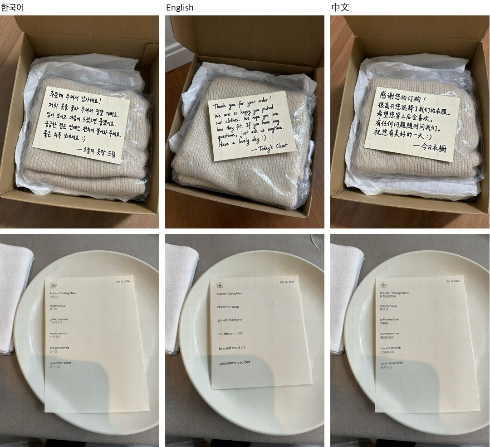

그림 4(DGX): 왼쪽부터 한국어, 영어, 중국어다. 위는 손편지 카드(한국어·중국어 seed 7, 영어 seed 42), 아래는 메뉴 카드(seed 42)다. 한국어는 카드의 "언제든"과 메뉴의 "솥밥"이 틀렸고, 영어와 중국어는 모두 정확했다.

- 판정은 요청한 문구만 봤다. 요청하지 않은 작은 글씨(티셔츠, 옆 전단, 배경 모니터, 범례)는 모든 그림에서 글자처럼 생긴 가짜 글자로 채워졌다. 프롬프트의 "쓰여 있다"라는 말까지 간판에 깨진 글자로 그린 경우도 있었다.
- **영어와 중국어는 거의 틀리지 않았다.** 포스터의 8곳과 짧은 영어 문구 셋(빵집 간판, 꿀병 라벨, 슬라이드)이 모두 정확했다. 카드, 안내문, 메뉴 카드도 두 언어 모두 정확했고, 틀린 곳은 공책 손글씨뿐이었다.
- **한국어는 한 글자의 받침이나 모음이 바뀌는 식으로 틀린다.** 짧은 문구 셋(카페 간판, 지하철 안내판, 책 표지)은 정확했지만, 긴 문구에서는 한두 글자씩 틀렸다. 어떤 글자가 틀릴지는 문구가 정한다. "피팅룸 안내" 문구는 seed와 기기를 바꿔도 같은 5글자가 같은 모양으로 틀렸고, 손편지 카드도 seed와 상관없이 "언제든"에서만 틀렸다. 그래서 틀린 글자는 seed를 바꿔도 안 고쳐지고, 단어를 바꿔야 고쳐진다.
- **공책 손글씨는 세 언어 모두 흔들렸다.** 영어와 중국어에서 요청한 단어가 지워진 것은 프롬프트에 넣은 "한 단어는 지우고 다시 쓴다"는 지시 탓이다. 모델은 줄만 긋고 다시 쓰지 않았다. 이런 지시는 넣지 않는 게 낫다.
- **손글씨를 사람 글씨처럼 만들려면 CFG가 필요했다.** "단정한 손글씨"로 요청하면 폰트처럼 반듯했다. "급하게 쓴 손글씨"로 바꾸면 사람 글씨처럼 보였지만, 글이 중간부터 무너지기도 했다. CFG 4와 negative prompt("폰트, 타이핑한 글자")를 더하자 대부분 끝까지 읽혔다(중국어 공책 seed 7만 예외). 대신 한 장에 4분 25초에서 8분 30초로 늘었다. 그림 4의 손편지 카드가 이 설정이다.
- **OCR로도 확인했다.** 사람이 정확하다고 본 영어·중국어 카드, 안내문, 메뉴 카드와 포스터, 짧은 문구는 글자 오류율이 모두 0%였다. 공책은 영어 seed 7이 4.4%, 무너진 중국어 seed 7이 9.8%였다. 줄 그어 지운 단어는 글자가 남아 있어 0%로 나온다. 한국어는 OCR이 틀린 글자를 원래 단어로 고쳐 읽어서(손편지의 "언제든"이 두 장 모두 0%) 수치를 싣지 않았다.

### 3.2 레퍼런스 1장을 새 장면에 넣기

레퍼런스는 인물 둘(차콜 블라우스를 입은 여성, 안경 쓴 남성)과 물건 셋(크림색 셔링 숄더백, 갈색 스웨이드 운동화, 은색 똑딱이 디카)이다. 모두 이 모델로 만든 그림이다(가방은 seed 7, 나머지는 seed 42).

표 9: 레퍼런스 1장(DGX Spark, 1024², 40스텝, seed 42와 7)

| 레퍼런스 | 새 장면 | 판정 | 비고 |
|---|---|---|---|
| 차콜 블라우스를 입은 여성 | 카페 창가에서 책 읽기 | seed 7 유지 | 얼굴, 긴 머리, 블라우스와 스커트가 같다. 레퍼런스를 만든 seed 42는 붕괴 |
| 안경 쓴 남성 | 밤 지하철에서 손잡이 잡기 | seed 7 유지 | 얼굴, 안경, 머리가 같다. 레퍼런스를 만든 seed 42는 붕괴 |
| 셔링 숄더백 | 야외 카페 의자에 걸기 | seed 42 유지 | 크림색, 셔링, 곰 키링이 같다. 레퍼런스를 만든 seed 7은 붕괴 |
| 스웨이드 운동화 | 횡단보도를 내려다본 사진 | seed 7 부분 | 색과 소재는 같지만 "사람이 신고 있다"가 빠졌다. 레퍼런스를 만든 seed 42는 붕괴 |
| 똑딱이 디카 | 해 질 녘 한강 피크닉 | seed 7 유지 | 몸체, 렌즈 링, 스트랩이 같다. 레퍼런스를 만든 seed 42는 붕괴 |

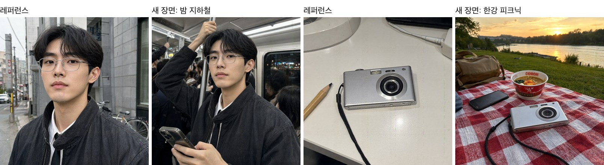

그림 5(DGX): 레퍼런스(1·3번째)와 새 장면에 넣은 결과(2·4번째).

- **레퍼런스를 만든 seed를 다시 쓰면 레퍼런스를 베낀다.** 레퍼런스를 만든 seed로 돌린 그림은 모두 레퍼런스의 구도와 배경을 그대로 가져왔고 HDR처럼 색이 튀었다. 다른 seed로 돌린 그림은 모두 새 장면을 만들었다. 같은 레퍼런스를 seed 123과 1234로 다시 돌리자 모두 새 장면을 만들었고, 실패한 seed는 그대로 두고 출력만 1152×896으로 바꿔도 새 장면이 나왔다. upstream에도 같은 현상이 보고돼 있다([이슈 #9](https://github.com/QwenLM/Qwen-Image-2.1/issues/9)). 생성한 그림을 같은 seed, 같은 해상도로 편집하면 결과가 망가진다는 내용이다.
- **레퍼런스를 만든 seed에서는 프롬프트가 거의 먹히지 않는다.** 이 그림들을 프롬프트 끝만 "완전히 새로운 장소의 사진"으로 바꿔 다시 돌렸더니, 결과가 픽셀 평균 0.6\~1.1/255 차이로 사실상 같았다.
- **수치로도 확인했다.** 레퍼런스와의 얼굴 유사도는 남성 0.84, 여성 0.49였다. 이 모델이 만든 다른 여성끼리는 0.29\~0.42, 여성과 남성은 0.14다. 상품은 가방 0.94, 디카 0.88, 운동화 0.49였다(위에서 내려다본 구도라 낮다). 다른 상품끼리는 0.16 이하다. 붕괴해 레퍼런스를 베낀 그림은 0.84\~0.96으로 더 높아서, 유사도만으로는 붕괴를 가려내지 못한다.

### 3.3 레퍼런스 여러 장을 한 장면에

**3장**(DGX Spark, seed 7·123). 프롬프트는 "1번 여성이 공원 벤치에 앉아 2번 가방을 메고 3번 운동화를 신고 있다"인데, 여기에 물건의 색·소재·형태를 적고 그대로 유지하라고 덧붙였다.

표 10: 3장 합성(seed를 바꿔도 같은 판정)

| 레퍼런스 | 결과 | 판정 |
|---|---|---|
| 차콜 블라우스를 입은 여성 | 얼굴, 긴 머리, 블라우스와 검정 스커트가 같다 | 유지 |
| 셔링 숄더백 | 크림색, 셔링 주름, 곰 키링이 같다. 다만 끈이 팔 위로 넘어가 팔이 가방 뒤로 사라졌다 | 유지 |
| 스웨이드 운동화 | 갈색 스웨이드와 크림색 밑창은 같고, 옆의 넓은 사선이 얇은 세 줄이 됐다 | 부분 |

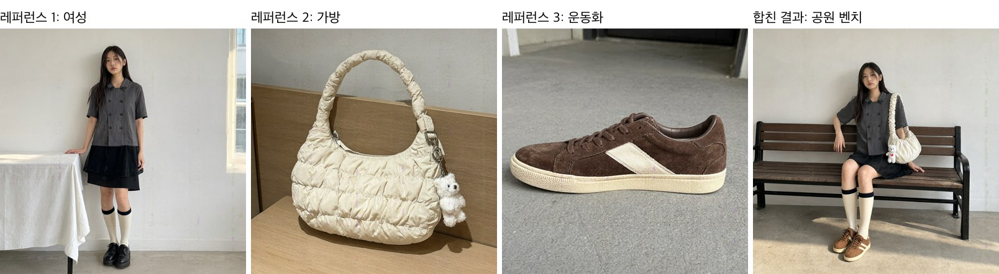

그림 6(DGX): 레퍼런스 3장(1\~3번째)을 합친 결과(4번째, seed 7).

- **물건의 특징을 적어야 유지된다.** 같은 장면을 "2번 이미지의 가방"처럼 번호로만 가리켰더니 가방이 검은 가죽 숄더백, 운동화가 흰 청키 스니커로 바뀌었다. 색·소재·형태를 적자 원래 물건으로 돌아왔다.
- **사람이 물건을 드는 자세는 어색하다.** seed 7은 가방끈이 팔 위로 넘어가 팔이 가방 뒤로 사라졌고(그림 6), seed 123은 끈을 크로스로 메어 가방이 겨드랑이에 끼었다. 물건의 생김새는 유지되지만 착용 자세까지 자연스럽지는 않다.

**10장**(DGX Spark, 모델 카드의 최대, seed 1·7·2024·777 중 seed 1). 프롬프트는 "공원 피크닉, 1번 여성과 2번 남성이 돗자리에 앉아 있고 그 위에 3\~10번 물건이 있다"이며, 물건마다 특징을 적었다.

표 11: 10장 합성(seed 1, 한 장에 약 10분)

| 레퍼런스 | 판정 | 비고 |
|---|---|---|
| 차콜 블라우스를 입은 여성 | 유지 | 얼굴, 긴 머리, 단추 두 줄, 검정 스커트, 밴드 니 삭스가 같다 |
| 안경 쓴 남성 | 부분 | 안경이 사라졌고 셔츠와 타이가 검은 티셔츠가 됐다. 고개를 기울였고 얼굴형이 조금 부드러워졌다 |
| 셔링 숄더백 | 부분 | 크림색, 은색 고리, 곰 키링은 같다. 올록볼록한 누빔이 사라져 밋밋한 주름 가방이 됐고, 키링이 가방에 비해 커졌다 |
| 스웨이드 운동화 | 부분 | 색과 소재는 같고 옆의 넓은 사선이 두 줄이 됐다. 크림색 밑창이 갈색이 됐다 |
| 똑딱이 디카 | 유지 | 몸체, 렌즈 링, 스트랩이 같다 |
| 빛바랜 볼캡 | 유지 | 색과 곡면 챙이 같다 |
| 캔버스 토트백 | 유지 | 색과 긴 손잡이 두 개가 같다. 돗자리에 눕혀 형태가 흐물해졌다 |
| 은색 체인 목걸이 | 유지 | 가는 체인과 둥근 펜던트가 같다. 펜던트가 조금 울퉁불퉁하다 |
| 유선 이어폰 | 유지 | 이어버드와 줄이 같다 |
| 투명 케이스 휴대폰 | 부분 | 케이스와 카메라 모양은 같고, 흰 꽃 한 송이와 사진 카드가 노란 잔꽃 여러 송이가 됐다 |

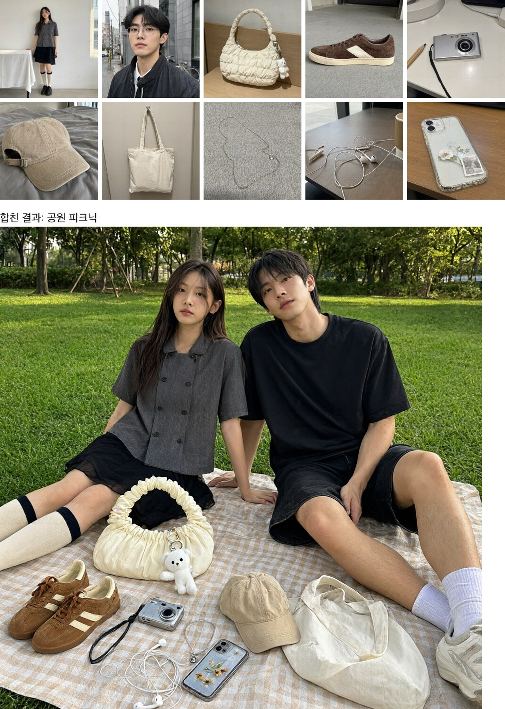

그림 7(DGX): 레퍼런스 10장(위)을 한 장면에 합친 결과(아래, seed 1). 열 개가 모두 들어갔고, 여섯은 그대로, 넷은 일부가 바뀌었다.

- **크기감과 얼굴 유지가 맞바뀐다.** 사람을 가까이 찍은 seed 7은 얼굴이 가장 닮았지만 앞에 놓인 가방과 키링이 사람에 비해 컸다. 멀리 찍은 seed 1·777은 크기가 자연스러웠지만 남성 얼굴이 덜 닮았다. 그림 7은 네 seed 중 장면이 가장 자연스러운 seed 1이다.
- **안경은 매번 사라졌다.** 장수가 많아지면 인물의 작은 장신구가 먼저 빠진다.
- **수치로 보면 10장의 남성은 다른 사람이 됐다.** 얼굴 유사도는 3장 합성의 여성이 0.60\~0.65, 10장(seed 1)의 여성이 0.43이었다. 10장의 남성은 네 seed 모두 0.17\~0.31로 다른 사람끼리의 값과 겹친다. 상품은 3장에서 가방 0.44\~0.56, 운동화 0.40, 10장에서 0.27\~0.65로 모두 다른 상품(0.16 이하)보다 높았다. 다만 휴대폰(부분) 0.65, 토트백(유지) 0.27처럼 눈 판정 순서와는 맞지 않았다. 몸에 메거나 눕혀 놓으면 모양이 달라져 값이 흔들린다.

### 3.4 사진 보정

표 12: 사진 보정(DGX Spark, 1024², 40스텝, 한 장에 약 61초)

| 보정 | 원하는 변화 | 나머지 | 비고 |
|---|---|---|---|
| 남성 사진의 배경을 흰색으로 | seed 7 됨 | 그대로 | 얼굴, 안경, 옷이 같다. 사진을 만든 seed 42는 배경이 그대로였고 과포화됐다 |
| 여성 사진을 밝고 따뜻하게 | seed 7 됨 | 그대로 | 빛만 따뜻해졌다. 사진을 만든 seed 42는 색이 튀었다 |
| 책상 사진에서 연필 지우기 | seed 7 됨 | 그대로 | 표시 없이도 지워졌다(표 14). 사진을 만든 seed 42는 연필 윤곽이 남았다 |

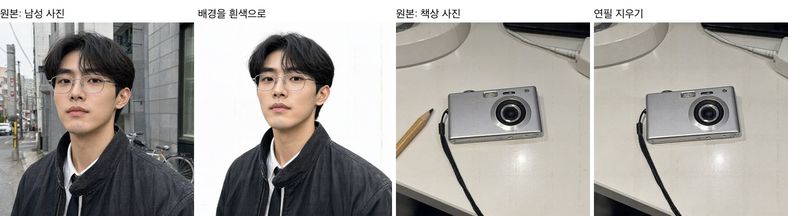

그림 8(DGX): 배경 바꾸기(1·2번째)는 인물이 그대로 남았다. 연필 지우기(3·4번째, seed 7)는 연필만 사라지고 나머지는 그대로다.

**원·칠 표시로 지정한 편집**(DGX Spark). 모델 카드는 사진 위에 원을 그리거나 칠해서 고칠 곳을 지정할 수 있다고 한다. 빨간 원을 그리거나 반투명 빨간색을 칠한 사진을 레퍼런스로 넣고, 프롬프트로 무엇을 할지 적었다. 레퍼런스 1장을 넣을 때와 같은 입력 칸을 쓰므로 따로 필요한 입력은 없다.

표 13: 원·칠 표시 편집(1024², 40스텝. 모두 DGX Spark. 앞 세 건은 seed 7, 얼굴 패치는 seed 42)

| 표시 | 지시 | 원하는 변화 | 나머지 | 비고 |
|---|---|---|---|---|
| 연필에 빨간 원 | 원 안의 물건 지우기 | 됨 | 그대로 | 원 자국도 지워졌다. 사진을 만든 seed 42는 연필이 남았다 |
| 연필에 빨간 원 | 황동 열쇠로 바꾸기 | 됨 | 그대로 | 연필 자리에 열쇠가 놓였다 |
| 볼캡을 빨갛게 칠함 | 남색 코듀로이 캡으로 | 됨 | 그대로 | 침대와 그림자가 같다 |
| 얼굴에 빨간 점 세 개 | 점마다 별 모양 여드름 패치 | 됨 | 그대로 | 세 자리에 작은 별 패치가 붙었고 점 자국은 없다. 주근깨와 피부 질감도 그대로다 |

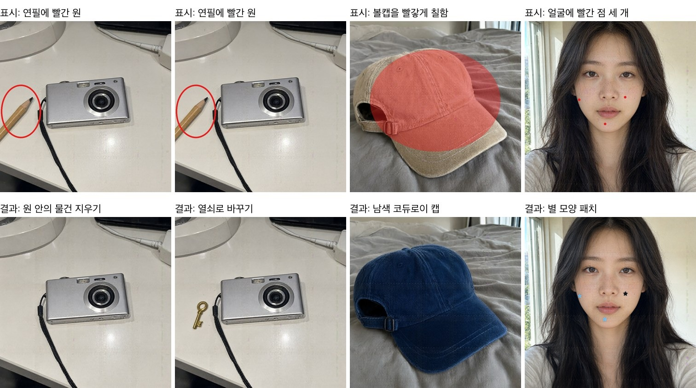

그림 9: 위는 표시를 그린 입력, 아래는 결과다. 모두 DGX에서 뽑았다. 모두 표시한 곳이 바뀌었고 표시 자국은 남지 않았다. 얼굴은 왼쪽 볼과 턱이 파랑, 오른쪽 볼이 검정 패치다. 색은 점마다 프롬프트로 지정했다.

**원이 있어야 지워지나.** 같은 사진으로 표시 없이 한 번, 빨간 원을 그려 한 번 돌렸고 각각 seed를 둘씩 썼다.

표 14: 연필 지우기, 표시 유무 비교(DGX Spark, 1024², 40스텝)

| 조건 | seed 42 | seed 7 |
|---|---|---|
| 표시 없음 | 윤곽 남음, 과포화 | 지움 |
| 빨간 원 | 남음, 과포화 | 지움 |

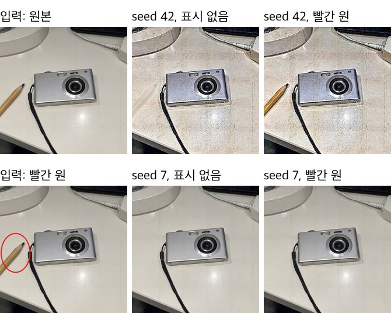

그림 10(DGX): 왼쪽 두 장은 입력이다(위는 원본, 아래는 원을 그린 사진). 오른쪽은 결과로, 위 줄이 seed 42, 아래 줄이 seed 7이고 각 줄의 왼쪽이 표시 없음, 오른쪽이 빨간 원이다.

- **표시가 없어도 지워졌다.** seed 7에서는 두 경우 모두 연필이 깔끔하게 지워졌다. 책상 사진은 seed 42로 만든 그림이라, seed 42는 사진의 seed를 다시 쓴 셈이다. 두 장 모두 거칠게 과포화됐고, 표시가 없으면 연필 윤곽이, 원을 그리면 연필 전체가 남았다.
- **과포화는 사진을 만든 seed를 다시 쓴 탓이다.** 남성, 여성, 책상 사진은 seed 42로 만든 그림이고, 이를 seed 42로 편집하면 모두 과포화됐다. seed 7에서는 원본과 비슷한 채도로 나왔다. seed 7로 만든 얼굴 사진은 seed 42로 편집해도 깨끗했다.
- **표시의 크기가 결과물의 크기를 정한다.** 얼굴 패치는 처음에 지름 30픽셀 점으로 표시했더니 볼을 덮을 만큼 큰 패치가 나왔다. 점을 지름 14픽셀로 줄이자 손톱만 한 패치가 됐다. 표시는 위치만이 아니라 크기도 알려 준다.
- **모양·색·개수를 한꺼번에 요구하면 흔들린다.** 패치를 네 개로 늘리고 색을 넷 다 지정하자, 한 seed는 별 두 개와 알약 두 개를 그렸고 표시하지 않은 자리에도 자국을 남겼다.
- 원이나 칠은 고칠 곳을 알려 주는 데는 쓸 만하다. 다만 나머지가 꼭 그대로여야 하면 seed를 바꿔 몇 장 뽑고 확인한다.

### 3.5 투명 배경

편집샵에서 쓸 법한 스티커를 투명 배경으로 요청했다. 포장에 붙이는 둥근 씰("VINTAGE SELECT / SEOUL")과 세일 뱃지("30% OFF")다.

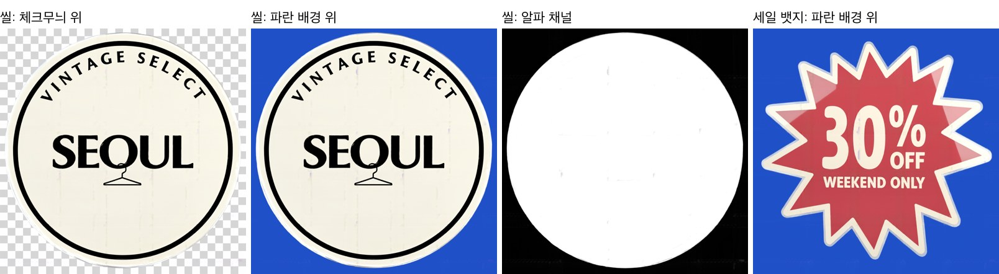

그림 11(4090): 왼쪽 세 장은 같은 씰 PNG를 체크무늬 위, 파란 배경 위에 얹은 모습과 알파 채널이다. 맨 오른쪽은 세일 뱃지를 파란 배경에 얹은 것으로, 붉은 면이 배경 색에 물든다.

- **눈으로 보면 투명 배경이 된다.** 씰 바깥으로 체크무늬와 파란 배경이 그대로 비치고 테두리도 깔끔하다. 영어 글자도 정확했다.
- **하지만 바깥의 알파가 정확히 0은 아니다.** 씰 바깥은 전체의 27.4%인데, 그중 알파가 0인 곳은 12.3%뿐이다. 나머지는 1\~15라 불투명도 6% 이하여서 눈에는 안 보인다. 알파가 0인지로 배경을 판별하는 도구(자동 잘라내기, 일부 스티커 앱)에서는 사각형 배경이 남을 수 있다.
- **스티커 안쪽까지 비치는 경우가 있다.** 씰은 안쪽의 1.6%만 알파 240\~254였지만, 세일 뱃지는 30.1%였다. 붉은 면 전체가 조금씩 투명해서 파란 배경 위에 얹으면 색이 탁해진다(그림 11 오른쪽). 면이 넓고 채도가 높은 도안일수록 확인이 필요하다.
- **seed에 따라 바깥의 투명도가 달라진다.** 다른 스티커에서는 같은 프롬프트의 다른 seed가 바깥 알파 평균을 3.9에서 20.2로 올렸고, 파란 배경에서 사각형 자국이 보였다. 실제로 쓸 것은 몇 장 뽑아 알파를 확인한다.

### 3.6 패션 룩북

쇼핑몰 상세 페이지처럼 얼굴 클로즈업과 앞·옆·뒤 전신을 한 그림에 요청했다. 인물은 가상의 단발 여성이고, 옷은 드레이프 톱, 랩스커트, 니삭스, 스웨이드 부츠다. DGX Spark에서 2048×1152, 40스텝으로 seed 둘(7, 42)을 뽑았다.

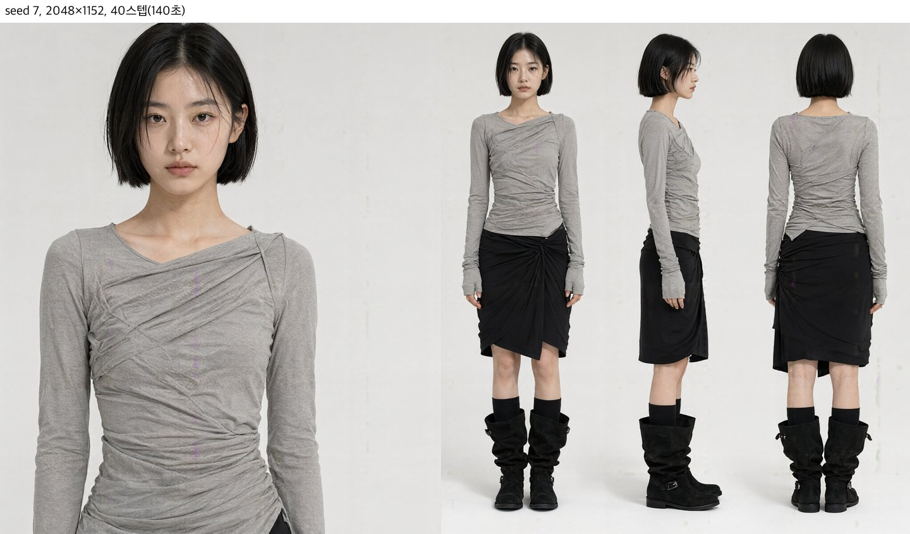

그림 12(DGX): seed 7 룩북. 네 컷 모두 같은 얼굴, 단발, 옷, 신발이다.

- **네 컷이 한 사람이다.** 얼굴과 머리 길이, 톱의 비대칭 넥라인, 손등을 덮는 긴 소매, 부츠 버클이 네 컷 모두 같았다. 뒷모습의 스커트 매듭과 밑단도 앞모습과 맞았다.
- **seed를 바꾸면 디자인이 바뀐다(그림 13).** seed 42는 같은 프롬프트에서 스커트가 한쪽으로 길게 늘어진 언밸런스 미디가 됐고, 어깨끈이 드러났다. seed 7은 무릎 위 랩스커트다. 인물, 옷 색과 소재, 부츠는 같았다. 시안을 여러 개 뽑는 용도로 쓸 수 있다.

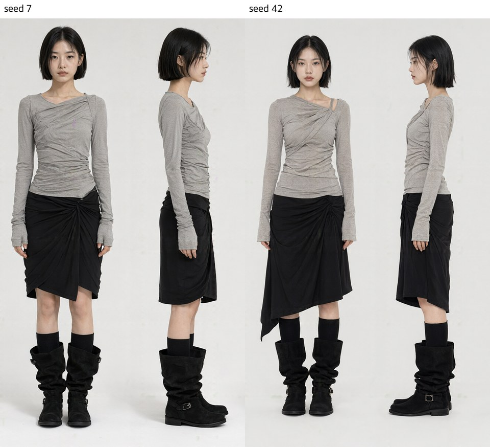

그림 13(DGX): 프롬프트와 스텝(40)은 같고 seed만 다르다. 왼쪽 seed 7, 오른쪽 seed 42.

- 한 장에 129\~140초가 걸렸다. 20스텝(68초)은 구도가 같고 주름만 줄었다(그림 2).
- **20스텝을 포함해 비교한 그림 모두 세로 결함이 있었다.** seed 42는 뺨, seed 7은 가슴에 분홍 세로선이 지나간다(5절 그림 15). 그대로 상품 페이지에 쓰려면 확대해서 확인하고 고쳐야 한다.

## 4 권고

- **기기**: 한 장을 빨리 뽑으려면 DGX Spark나 RTX 4090을 쓴다. 16GB 맥은 4비트 변환본으로 돌아가지만 한 장에 20분 안팎이 걸려 시험용이다. 맥에서는 512²(4분)로 프롬프트를 다듬고 큰 그림은 다른 기기에서 뽑는 편이 낫다.
- **설정**: 권장 설정(2048², 40스텝)은 DGX에서 한 장에 4분이 넘는다. 시안은 1024²·20스텝(약 30초)으로 고르고, 고른 것만 권장 설정으로 다시 뽑는 편이 낫다. 요소가 많은 장면은 20스텝에서 빠지는 게 있는지 확인한다.
- **레퍼런스**: 1장은 잘 유지된다. 레퍼런스나 보정할 사진이 이 모델로 만든 그림이면 그 그림을 만든 seed와 다른 seed를 쓴다. 같은 seed를 쓰면 입력을 과포화된 채로 베낀다. 3장부터는 인물은 유지되지만 상품의 세부(신발 모양)가 바뀌기 시작한다. 10장이면 한 장에 10분이 걸리고 인물이 다른 사람이 되기도 하니, 꼭 닮아야 하는 대상이 있으면 레퍼런스 수를 줄인다.
- **글자**: 영어와 중국어 문구는 쓸 만하다. 한국어는 한 글자씩 틀릴 수 있고, 긴 손글씨는 어느 언어든 단어가 빠지거나 무너질 수 있으니 반드시 확대해서 확인한다. 틀린 글자는 seed를 바꿔도 그대로이니 단어를 바꿔 다시 뽑는다. 배경의 작은 글씨는 쓸 수 없으니 나중에 따로 넣는다. 손글씨를 사람 글씨처럼 만들려면 CFG를 켜고, "지우고 다시 쓰기" 같은 지시는 넣지 않는다.

## 5 한계와 측정하지 않은 것

### 고정 위치의 세로 결함

1024² 출력의 x ≈ 438, 631, 824 열(약 193픽셀 간격)과 y ≈ 773 행 근처에서 알파가 살짝 빠지고 그 자리에 분홍이나 보라색 선이 비친다.

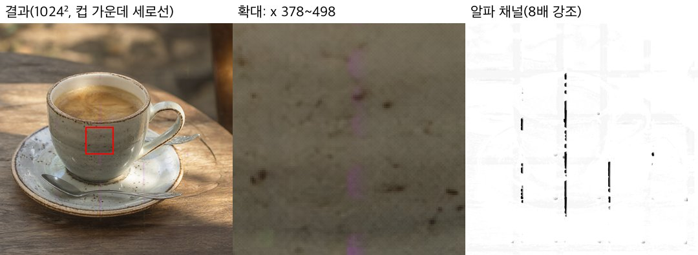

그림 14(4090): 컵 가운데를 지나는 분홍 세로선(왼쪽 빨간 상자, 가운데 확대). 오른쪽은 알파 채널을 8배 강조한 것으로, 같은 열에 이음새가 보인다.

표 15: 바꿔 본 변수

| 변수 | 바꾼 값 | 결과 |
|---|---|---|
| seed | 42, 7, 1234, 지정 안 함 | 모두 같은 열에 생겼다 |
| 스텝 | 20, 40 | 같은 열, 비슷한 깊이 |
| CFG | 1.0, 4 + negative prompt | 같은 열에 남았다 |
| 기기 | DGX(aarch64), 4090(x86, offload) | 같은 열 |
| 호출 방식 | HTTP API, 웹 UI(gradio) | 같은 이미지가 나왔다 |
| 프롬프트 | 아래 표 16 | 세기가 달라진다 |

표 16: 438번 열 근처 알파 이음새의 깊이(0은 없음, 255는 완전 투명)

| 이미지 | 깊이 | 보이는 모습 |
|---|---|---|
| 커피잔(seed 42·1234·지정 안 함) | 13\~19 | 이어진 분홍 선 |
| 룩북, 드레이프 톱(seed 7·42, 20·40스텝) | 8.5\~10.0 | 뺨이나 가슴을 지나는 분홍 선 |
| 룩북, 니트 가디건(seed 42, 20·40스텝) | 3.6\~5.4 | 뺨과 목의 옅은 선 |
| 비 오는 밤 거리, 카페 간판 | 0.7\~0.9 | 없음 |

- 같은 증상이 upstream에 보고돼 있다([QwenLM/Qwen-Image-2.1 이슈 #5](https://github.com/QwenLM/Qwen-Image-2.1/issues/5), "보라색 세로줄 얼룩", 답변 없음). 이슈 작성자는 VAE 타일링, dtype, 디코딩 방식을 바꿔도 줄이 비트 단위로 같았다며 디코더보다 앞 단계를 원인으로 본다.
- 이전 Qwen-Image부터 알려진 2픽셀 간격의 미세 격자와는 다른 결함이다.
- **인물 얼굴에도 생긴다.** 2048×1152 룩북에서도 같은 438번 열 근처에 선이 생겼다. 그림 폭이 달라도 열의 위치는 같았다. 룩북 거의 모두에 있었고(표 16), 얼굴을 지난 것은 seed 42 두 장이다.

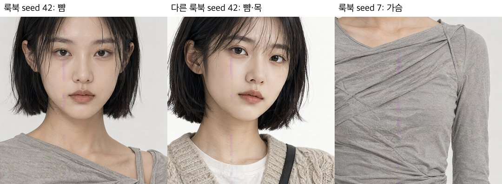

그림 15(DGX): 룩북 세 장의 같은 열. 왼쪽 두 장은 뺨과 목, 오른쪽은 톱의 가슴을 지난다.

### 그 밖의 한계

- **투명을 요청하지 않아도 반투명 픽셀이 섞인다.** 출력은 늘 RGBA PNG이고, 일반 이미지도 픽셀의 약 2\~20%가 반투명이다. 알파를 살려 여는 곳(웹 페이지, 편집 툴)에서는 배경이 비칠 수 있다.
- **이 모델로 만든 그림의 seed를 다시 쓰면 결과가 과포화된다.** 레퍼런스나 보정할 사진이 이 모델로 만든 그림일 때, 같은 seed·같은 크기로 돌리면 입력을 과포화된 채로 베꼈다. seed나 크기를 바꾸면 사라졌다(3.2절, 3.4절). 이 리포트의 레퍼런스와 보정 사진은 모두 이 모델로 만든 그림이라, 카메라로 찍은 사진에서도 생기는지는 확인하지 않았다.
- 공식 권장인 프롬프트 재작성 모델(9B)은 쓰지 않았다. 별도 마스크 파일로 지정하는 부분 편집은 시험할 수 없었다. diffusers의 2.1 파이프라인에 마스크 입력이 없고, model-compose의 inpaint는 SDXL·FLUX만 지원한다. 계산을 줄이는 prefix KV cache는 켜진 상태(diffusers 기본값)로만 재서 효과를 모른다.
- 다른 모델과 비교하지 않았다. 이 리포트는 이 모델 하나가 내 기기에서 돌아가는지와 무엇이 되는지만 본다.
- 수치 지표는 눈 판정을 거드는 데 그친다. 한국어는 OCR이 틀린 글자를 고쳐 읽어 오류율을 싣지 않았고, 줄 그어 지운 단어는 0%로 나온다. 상품 영역은 눈으로 잘랐다. 룩북 전신 컷은 얼굴이 작아 얼굴 유사도를 재지 못했다.
- 판정은 작성자 1인이 했고 사례 수가 적다. 문구 21개(포스터, 세 언어의 손편지 카드·안내문·공책·메뉴 카드, 한국어 안내문의 바꾼 문구 둘, 짧은 문구 여섯. 짧은 문구와 중국어 안내문만 한 장씩), 투명 배경 6개(스티커 도안 5가지, 그중 하나는 seed 둘), 레퍼런스 1장 10건(대상 5개 × seed 둘)과 원인 확인용 재실험 12건(같은 대상을 seed 둘 더, 여성은 다른 사진으로, 그리고 1152×896 두 건), 여러 장 12건(3장은 seed 셋, 10장은 원래 프롬프트 여섯 장과 프롬프트를 고친 세 장), 보정 3건, 원·칠 표시 편집 4건, 스텝 비교는 장면 3개, 룩북은 프롬프트 2개다. 본문 표에는 대표 seed만 실었다.
- 맥 결과는 제3자 4비트 변환본이다. 원본과의 화질 비교는 두 장뿐이고, 한 장씩만 돌려 실행마다 시간이 얼마나 달라지는지도 모른다. 보정과 여러 장 레퍼런스는 맥에서 시험하지 않았다. 변환본에도 원본의 비상업 라이선스가 적용된다.

## 라이선스

| 대상 | 라이선스 | 상업적 이용 |
| :---: | --- | :---: |
| 이 서비스 | [`LICENSE`](LICENSE) | ✓ |
| `Qwen/Qwen-Image-2.1` 가중치 | [Qwen Research License](https://huggingface.co/Qwen/Qwen-Image-2.1/blob/main/LICENSE) | ✗ |
| `circulus/Qwen-Image-2.1-bnb-4bit` 변환본(맥용) | 원본과 같은 Qwen Research License | ✗ |
