[English](README.md) · [한국어](README.ko.md) · [中文](README.zh-cn.md)

# image-generation-qwen-image-2.1

This service generates images from a text prompt and, given a reference photo, places its person or product in a new scene or edits the photo.

We served Qwen-Image-2.1, a single model for both text-to-image generation and editing, with model-compose and ran it on an NVIDIA DGX Spark and an RTX 4090. We looked at whether the model runs on your device and, if it does, what it does well and badly; we did not compare it with other models. The original weights do not fit on an Apple M2 16GB, so there we only checked whether a third-party 4-bit quantization runs. Text, reference, and edit results were judged by eye by a single author, alongside two measurements: a text error rate and similarity to the reference.

## Contents

- [Quick Start](#quick-start)
- [Summary](#summary)
- [1 Setup](#1-setup)
- [2 Does it run on my device?](#2-does-it-run-on-my-device)
- [3 Results by feature](#3-results-by-feature)
  - [3.1 Text rendering](#31-text-rendering)
  - [3.2 Placing one reference into a new scene](#32-placing-one-reference-into-a-new-scene)
  - [3.3 Multiple references in one scene](#33-multiple-references-in-one-scene)
  - [3.4 Photo retouching](#34-photo-retouching)
  - [3.5 Transparent background](#35-transparent-background)
  - [3.6 Fashion lookbook](#36-fashion-lookbook)
- [4 Recommendations](#4-recommendations)
- [5 Limitations and what we did not measure](#5-limitations-and-what-we-did-not-measure)
- [License](#license)

## Model

[`Qwen/Qwen-Image-2.1`](https://huggingface.co/Qwen/Qwen-Image-2.1) is an open image model that does both text-to-image generation and photo editing with a single set of weights.
It takes up to 10 reference images, renders text inside the picture, and can produce images with a transparent background (RGBA).

## Demo


## Quick Start

It needs [model-compose](https://github.com/hanyeol/model-compose) 0.4.111 or later.

Install with [uv](https://docs.astral.sh/uv/):

```bash
uv pip install model-compose
```

Or with pip:

```bash
pip install model-compose
```

Clone this repository:

```bash
git clone https://github.com/MindrLabs/image-generation-qwen-image-2.1
cd image-generation-qwen-image-2.1
```

Run it:

```bash
model-compose up
```

The gradio interface opens on `http://localhost:8081` and the HTTP API on `http://localhost:8080/api`.
`SERVER_PORT` and `PORT` change each port.

| On the first run | What happens |
| :---: | --- |
| Virtual environment | model-compose builds an environment at `.venv/qwen-image` and installs torch and diffusers main |
| Checkpoints | it downloads `Qwen/Qwen-Image-2.1` at 33 GB. No token is needed; `HF_TOKEN` only raises the download rate limit |

`DEVICE` defaults to `auto`, which picks CUDA on an NVIDIA GPU and MPS on a Mac.
`cpu_offload: model` is on, so a 24 GB GPU can run it; keep at least 50 GB of system RAM free. It only applies on CUDA.
On a GPU with 40 GB or more, removing `cpu_offload` makes it faster: on the DGX Spark, one 1024², 40-step image with a reference took about 4 min 20 s with it and 62.5 s without. The DGX Spark numbers below were measured without it.
The original weights do not fit on a 16 GB Mac. Swap `model` in the component for a third-party 4-bit copy:

```yaml
  model:
    provider: huggingface
    repository: circulus/Qwen-Image-2.1-bnb-4bit
    token: ${env.HF_TOKEN | }
  quantization:
    type: nf4
    compute_dtype: bfloat16
    double_quant: false
```

With `max_concurrent_count: 1`, a second request waits until the first one finishes.

Example request:

```bash
curl -o out.png localhost:8080/api/workflows/runs \
  -F workflow_id=generate -F wait_for_completion=true -F output_only=true \
  -F "input.prompt=A poster that says HELLO in bold letters" -F input.seed=42 \
  -F input.width=1024 -F input.height=1024 -F input.inference_steps=40
```

## Summary

1. On the DGX Spark, one 1024² image took 54 s at 40 steps and 28 s at 20 steps. The officially recommended setting (2048², 40 steps) took 4 min 16 s. The original weights (33 GB) do not fit on a 16GB Mac, but a 4-bit conversion (11.4 GB) runs. One 1024², 20-step image takes 19 minutes.
2. English and Chinese text in the image was almost never wrong. Korean was correct in short phrases, but in handwriting and on the menu card one syllable's final consonant or vowel changed. The wording decides which character fails: the same character comes out wrong the same way across seeds and machines, and only rewording fixes it. A 7-line handwritten notebook page wobbled in all three languages. Background text that was not requested is always fake text.
3. Placing one reference image into a new scene preserves people and products well. If the reference is an image this model generated, do not reuse the seed that generated it: at that seed the model copied the reference in oversaturated form instead of making a new scene, while every other seed reached the new scene. Retouching behaves the same way; background replacement and color correction were clean at other seeds. Edits that mark the area to change by drawing a circle or painting on the photo also worked.
4. Putting 10 reference images into one scene includes every item, though some resemble the reference less (6 preserved, 4 partial). One image took about 10 minutes.
5. Some images show a faint pink vertical line at fixed positions. It did not go away with any setting change, so we attribute it to the model.

Table 1: Summary by device

| Device | Does it run? | One 1024², 40-step image | Memory |
|---|---|---|---|
| Apple M2 16GB | Runs with the 4-bit conversion | Not measured (20 steps: 19 min) | 13 GB (17 GB with one reference, swapping) |
| RTX 4090 24GB | Runs (requires CPU offload) | About 45 s (3 manual requests) | 19.8 GB of VRAM, 45 GB of system RAM |
| DGX Spark | Runs | 54 s | 31.6 GB |

## 1 Setup

Table 2: Devices

| Device | Accelerator | Memory | Conditions |
|---|---|---|---|
| DGX Spark | GB10, driver 580.126.09, CUDA 13.0 | 120 GB unified | Shared. Measured with about 93 GB free |
| RTX 4090 workstation | 1× RTX 4090 | 24 GB | `cpu_offload: model` |
| MacBook (Apple M2) | MPS | 16 GB unified | Measured with the browser closed. 4 GB of swap was already in use before starting |

- Software: model-compose upstream `5e82e0e3` (2026-09-21), diffusers 0.41.0.dev0, transformers 5.17.0, bf16. torch was 2.13.0 cu130 (aarch64) on the DGX, 2.14.0 cu126 on the 4090, and 2.14.0 (MPS) on the Mac. Only the Mac additionally used bitsandbytes 0.50.2.
- Weights: `Qwen/Qwen-Image-2.1` revision `790c9263`. Only the Mac used the third-party 4-bit (nf4) conversion `circulus/Qwen-Image-2.1-bnb-4bit`.
- DGX text-to-image speed was measured by running each condition twice with the same seed (42), excluding the first request after server start.
- Reference, editing, and 4090 numbers come from requests sent directly to the server.
- Measurements: text was read back with Qwen2.5-VL-7B for a character error rate (CER). Similarity to the reference is cosine similarity, with InsightFace (antelopev2) for people and DINOv2-base on a crop of the product for products.
- Default settings: 1024², 40 steps, `true_cfg_scale` 1.0 (CFG off). CFG makes the image follow the prompt more strongly; turning it on doubles computation per step and slows generation.
- All references are fictional people and products generated with this model beforehand. No photos of real people were used.

The 4090 and DGX use the same weights and precision (bf16), so we considered it fine to mix their quality judgments. However, different devices produce different images even with the same seed, so reproducing an image requires running it on the device noted in each figure and table.

## 2 Does it run on my device?

Table 3: Time per image on DGX Spark (median, via server)

| Resolution | 20 steps | 40 steps | Peak memory |
|---|---|---|---|
| 1024² | 28.3 s | 54.1 s | 31.6 GB |
| 2048² (officially recommended) | 2 min 14 s | 4 min 16 s | 33.7 GB |

**Steps and seeds.** This model starts from random noise and builds the image by removing noise little by little. Each removal pass is one step. More steps are slower but bring out more detail. Time is nearly proportional to step count, and the default is 40. The seed is the number that determines the starting noise. The same seed on the same device gives exactly the same image. On the DGX, both files generated under every condition were byte-identical. On a different device, the same seed gives a different image.

- Doubling the resolution (4× the pixels) takes about 4.7× longer.
- Starting the server and loading the model takes about 3 minutes.
- Repeated runs under the same conditions barely varied (four 1024², 20-step images took 28.2\~28.3 s).

Table 4: Time by number of references (1024², 40 steps)

| References | DGX Spark | RTX 4090 |
|---|---|---|
| None | 54 s | About 45 s (3 runs) |
| 1 | 62.5 s | 48.5 s (8 runs) |
| 3 | 184 s | Not measured |
| 10 | 598 s | Not measured |

- **RTX 4090**: 20 steps took 35 s, and with CFG on (`true_cfg_scale` 4) 65 s. These come from only a few requests, so they are less precise than repeated measurements.

### CPU offload and memory

Running on a 24 GB GPU is only possible with CPU offload. What it saves on the GPU, it takes from system RAM.

Offload keeps the weights in CPU memory and moves only the part whose turn it is to the GPU.

**`cpu_offload: model` moves the text encoder, the image model and the VAE one whole model at a time.** VRAM therefore drops to the size of the largest single piece, while the full set of weights stays in system RAM. The moves happen once per stage rather than once per step, so the speed cost is small. The 4090 was still faster than the DGX with offload on, likely because of its higher memory bandwidth (1,008 GB/s vs 273 GB/s) and compute.

Table 5: Memory by setting

| Device and setting | GPU memory | System RAM |
|---|---|---|
| RTX 4090 24GB, `cpu_offload: model` | 19.8 GB | 45 GB in the worker process |
| DGX Spark, no offload | 31.6 GB of unified memory | Unified, so the same memory |
| Apple M2 16GB, 4-bit | 13 GB of unified memory (17 GB with one reference) | Same memory, 10\~12 GB of swap |

### What do you lose with fewer steps?

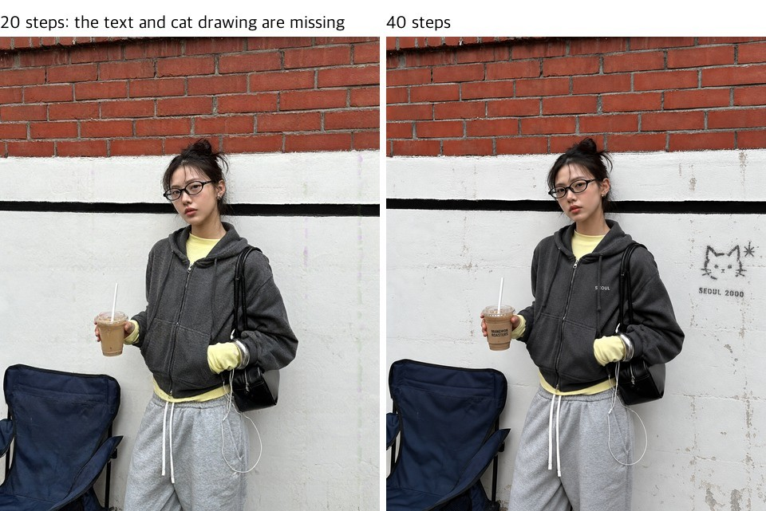

Figure 1 (DGX): Same prompt and seed (42), 20 steps (left) and 40 steps (right).

| Scene | 20 steps | 40 steps |
|---|---|---|
| Coffee cup and croissant | Composition and texture nearly identical to 40 steps | Slightly sharper |
| Seoul alley street snap | Same composition, person, and outfit. The prompt's cup sleeve text "MANGWON ROASTERS", the "SEOUL" on the chest, and the cat drawing on the wall are all missing | All three appear |
| Fashion lookbook (2048×1152, Figure 2) | Same composition, pose, and garment shape. Fewer wrinkles on the top and less shirring around the skirt knot, so the fabric looks smooth | More and sharper wrinkles and shirring |

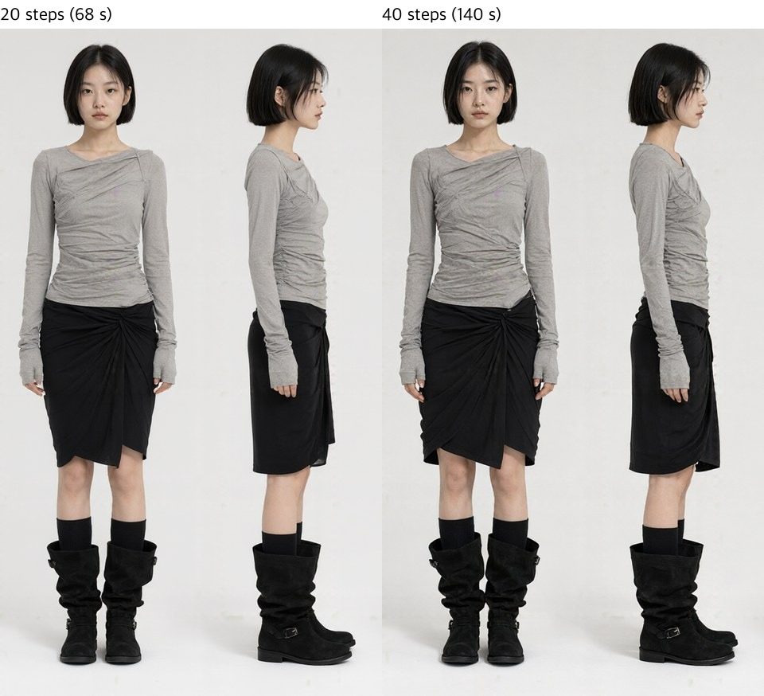

Figure 2 (DGX): Front and side full-body shots of the lookbook with the same seed (7). 20 steps (left) took 68 s; 40 steps (right) took 140 s.

20 steps takes half the time. Even with the same composition, prompt elements such as text or small drawings can go missing, and in images where texture matters, such as clothing, details like wrinkles are reduced.

### It runs in 4-bit on a 16GB Mac

Quantizing the original weights to 4 bits shrinks 33 GB to 11.4 GB (text encoder 6.7, image model 4.0, VAE 0.7). We served this conversion with model-compose.

Table 6: Apple M2 16GB vs. DGX Spark (1024², 20 steps, seed 42, one image each)

| Task | Mac 4-bit | DGX original | Mac memory |
|---|---|---|---|
| Text-to-image | 1142 s (19 min) | 31 s | 13 GB |
| One reference | 1627 s (27 min) | 35 s | 17 GB |
| For reference: 512² text-to-image | 226 s (4 min) | Not measured | 13 GB |

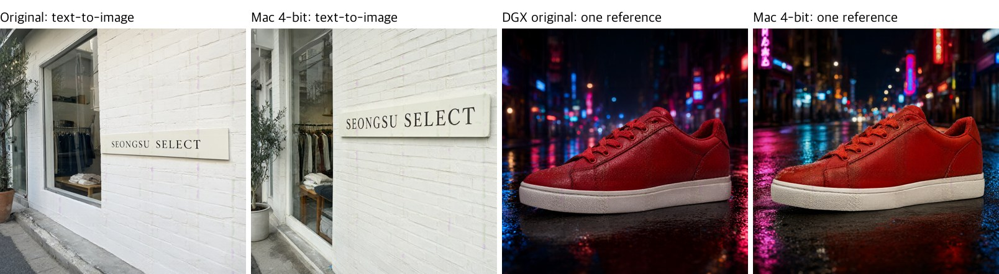

Figure 3: Text-to-image (1st and 2nd) and one reference (3rd and 4th), comparing the original weights with the Mac 4-bit version. The sign pair is the 4090 original (36 s) against the Mac 4-bit (1011 s); the sneaker pair is the DGX original against the Mac. Different devices give different compositions even with the same seed.

- **Both devices got the text right.** The English sign "SEONGSU SELECT" came out with all thirteen characters intact on the original weights and on the Mac 4-bit version, with clean strokes under magnification. A single line of large type survives the 4-bit conversion. With only one image each, we cannot say how it holds up on harder text.
- On both devices the sneaker's sole, laces, and leather texture were nearly identical to the reference.
- **Memory is why it is slow.** The model uses 13 GB, which grows to 17 GB with a reference, exceeding 16 GB of RAM. Swap rose to about 10\~12 GB. Each step took about 55 s for text-to-image and about 78 s with one reference.
- [Upstream issue #6](https://github.com/QwenLM/Qwen-Image-2.1/issues/6) reports that on Mac (MPS) input images of 512² or larger are silently corrupted, giving washed-out results. In our single-reference run the sneaker kept its color and texture, so the symptom did not show.

## 3 Results by feature

Table 7: Results by question

| Question | Result |
|---|---|
| Does it write text correctly? | English and Chinese are almost always correct. Korean is correct in short phrases, but handwriting and menu cards get 1\~5 characters wrong. A wrong character stays wrong across seeds; only rewording fixes it. Unrequested small text is filled with fake characters |
| Are people and products from my photos preserved in a new scene? | Preserved well. If the reference was generated by this model, reusing its seed copies the reference, oversaturated; any other seed works |
| How far does combining multiple images go? | Up to 10 all make it in. More images mean less resemblance |
| Can it retouch photos? | Background replacement and color correction work, as long as the seed differs from the one that generated the photo. Edits that mark the target area with a circle or paint also work |
| Does it output a transparent-background PNG directly? | Visually, yes. Tools that cut based on alpha being exactly 0 may leave background behind |
| Are the same person and outfit preserved across shots, like an online store lookbook? | Preserved across four shots (close-up, front, side, back) in one image. About 2 min per 2K image |
| Same seed, same image? | Exactly the same on the same device |
| Can it be used commercially? | No. The Qwen Research License allows research and evaluation only |

### 3.1 Text rendering

We made four everyday scenes in Korean, English and Chinese each: a handwritten thank-you card inside a delivery box, a handwritten fitting-room notice in a clothing shop, a handwritten notebook page, and a tasting menu card. Each was requested as if casually photographed with a phone, at the official 3:4 ratio (1792×2400) with two seeds (42, 7). An English-only university festival poster was made the same way. Six short phrases (three Korean, three English) were made once each at 1024².

Table 8: Scenes made in three languages (DGX Spark, 40 steps)

| Scene | Korean | English | Chinese |
|---|---|---|---|
| Handwritten thank-you card (6 lines) | Only "언제든" (anytime) was wrong in both images: seed 42 turned 제 into 세, and seed 7 dropped the ㅡ stroke from 든 | Correct | Correct |
| Handwritten fitting-room notice (8 lines) | The "피팅룸 안내" wording got the same five characters wrong in all three images, at both seeds and on the 4090 (룸 → 룽, 번 → 반, 밖 → 박, 이번 → 이반, 랙 → 택). A wording without those words was correct | Correct | Correct (seed 42 only) |
| Handwritten notebook page (7 lines) | Seed 7 got one character wrong (짧), seed 42 two (짧, 것 → 깃) | Seed 42 crossed out a requested word ("every") and never rewrote it. Seed 7 was correct but had faint fake writing between the lines | Seed 42 crossed out a requested character ("满") and never rewrote it. Seed 7 broke down from the third line |
| Tasting menu card (five dishes) | The English lines were correct. 솥밥 became 솔밤 in both images, and seed 7 also turned 갈비찜 into 갈비점 | Correct | Correct |


Figure 4 (DGX): Korean, English and Chinese from left to right. Top: thank-you cards (Korean and Chinese seed 7, English seed 42). Bottom: menu cards (seed 42). In Korean, "언제든" on the card and "솥밥" on the menu are wrong; the English and Chinese are all correct.

- Verdicts cover only the requested text. Unrequested small text (T-shirts, nearby flyers, background monitors, legends) was filled with fake characters in every image. One sign even rendered the prompt's own words "is written" as broken characters.
- **English and Chinese were almost never wrong.** All 8 spots on the poster and the three short English phrases (a bakery sign, a honey jar label, a slide) were correct. The card, the notice and the menu card were correct in both languages; the only mistakes were on the notebook page.
- **Korean goes wrong by swapping one syllable's final consonant or vowel.** The three short Korean phrases (a cafe sign, a subway sign, a book cover) were correct, but longer text got one or two characters wrong. The wording decides which character fails. The "피팅룸 안내" wording got the same five characters wrong the same way across seeds and machines, and the thank-you card failed only on "언제든" regardless of seed. So a wrong character is not fixed by a new seed, only by a different word.
- **The notebook page wobbled in all three languages.** The crossed-out words in English and Chinese come from the prompt's instruction to "cross out one word and rewrite it": the model crossed out and never rewrote. Leave such instructions out.
- **Handwriting needed CFG to look like a person wrote it.** Asking for "neat handwriting" looked like a font. Asking for "hurried handwriting" looked human, but the text sometimes broke down partway. Adding CFG 4 and a negative prompt ("font, typed text") kept most pages readable to the end (the Chinese notebook at seed 7 was the exception), at the cost of 8 min 30 s instead of 4 min 25 s per image. The thank-you cards in Figure 4 use this setting.
- **OCR agreed.** Every English and Chinese card, notice, menu card, poster and short phrase we judged correct had a 0% character error rate. On the notebook page, English seed 7 came out at 4.4% and the broken Chinese seed 7 at 9.8%. A crossed-out word still leaves its letters, so it reads as 0%. We do not report Korean: the OCR read wrong letters back as the intended word (both "언제든" cards came out at 0%).

### 3.2 Placing one reference into a new scene

The references are two people (a woman in a charcoal blouse, a man with glasses) and three products (a cream shirred shoulder bag, brown suede sneakers, a silver compact digital camera). All of them were generated by this model (the bag at seed 7, the rest at seed 42).

Table 9: One reference (DGX Spark, 1024², 40 steps, seeds 42 and 7)

| Reference | New scene | Verdict | Notes |
|---|---|---|---|
| Woman in a charcoal blouse | Reading by a cafe window | Preserved at seed 7 | Same face, long hair, blouse, and skirt. Seed 42, which generated the reference, collapsed |
| Man with glasses | Holding the pole on a night subway | Preserved at seed 7 | Same face, glasses, and hair. Seed 42, which generated the reference, collapsed |
| Shirred shoulder bag | Hanging on an outdoor cafe chair | Preserved at seed 42 | Same cream color, shirring, and bear keyring. Seed 7, which generated the reference, collapsed |
| Suede sneakers | Looking down at a zebra crossing | Partial at seed 7 | Same color and material, but "worn by a person" was dropped. Seed 42, which generated the reference, collapsed |
| Compact digital camera | Riverside picnic at sunset | Preserved at seed 7 | Same body, lens ring, and strap. Seed 42, which generated the reference, collapsed |

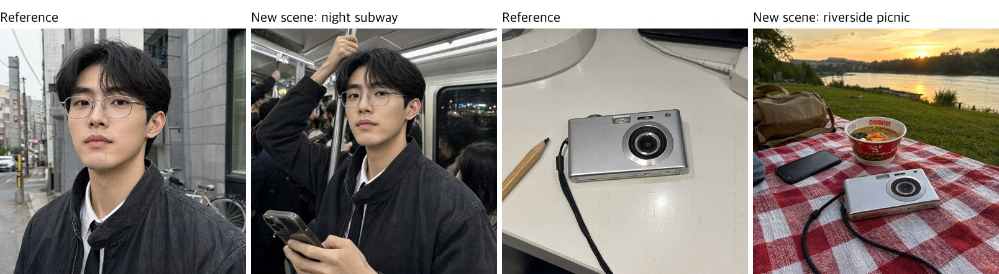

Figure 5 (DGX): References (1st and 3rd) and the results in new scenes (2nd and 4th).

- **Reusing the reference's own seed copies the reference.** Every run at the seed that generated the reference copied its framing and background and came out oversaturated like bad HDR. Every run at a different seed reached the new scene. Rerunning the same references at seeds 123 and 1234 reached the new scene every time, and keeping the failing seed but changing the output to 1152×896 also reached it. The same behavior is reported upstream ([issue #9](https://github.com/QwenLM/Qwen-Image-2.1/issues/9)): editing a generated image with its own seed at the same resolution distorts it.
- **At the reference's own seed the prompt barely matters.** Rerunning those runs with only the closing sentence changed to "a completely new photo in a new place" produced images that differed by 0.6\~1.1 of 255 per pixel on average.
- **Measured too.** Face similarity to the reference was 0.84 for the man and 0.49 for the woman. Other women this model made score 0.29\~0.42 against her, and the man 0.14. Products scored 0.94 (bag), 0.88 (camera) and 0.49 (sneakers, seen from above). Different products score 0.16 or less. Collapsed images that copied the reference score higher still, 0.84\~0.96, so similarity alone cannot catch a collapse.

### 3.3 Multiple references in one scene

**3 images** (DGX Spark, seeds 7 and 123). The prompt was "The woman from image 1 sits on a park bench with the bag from image 2 on her shoulder, wearing the sneakers from image 3," plus each item's color, material, and shape and an instruction to keep them unchanged.

Table 10: Combining 3 images (same verdict across seeds)

| Reference | Result | Verdict |
|---|---|---|
| Woman in a charcoal blouse | Same face, long hair, blouse, and black skirt | Preserved |
| Shirred shoulder bag | Same cream color, shirring, and bear keyring, though the strap runs over the arm and the arm disappears behind the bag | Preserved |
| Suede sneakers | Same brown suede and cream sole; the wide diagonal side stripe became three thin stripes | Partial |

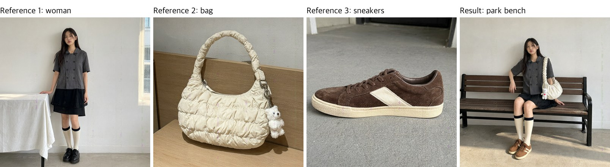

Figure 6 (DGX): Result (4th, seed 7) of combining three references (1st\~3rd).

- **Describing each item is what keeps it.** Pointing at "the bag from image 2" by number alone turned the bag into a black leather shoulder bag and the sneakers into white chunky trainers. Spelling out color, material, and shape brought the original items back.
- **The way a person holds an item looks off.** At seed 7 the strap runs over the arm and the arm disappears behind the bag (Figure 6); at seed 123 the bag is worn crossbody and wedged under the arm. The items keep their look, but not a natural way of wearing them.

**10 images** (DGX Spark, the model card's maximum, seed 1, picked from seeds 1, 7, 2024, and 777). The prompt was "A picnic in a park; the woman from image 1 and the man from image 2 sit on a blanket with items 3\~10 on it," again with each item described.

Table 11: Combining 10 images (seed 1, about 10 min per image)

| Reference | Verdict | Notes |
|---|---|---|
| Woman in a charcoal blouse | Preserved | Same face, long hair, the two rows of buttons, black skirt, and banded socks |
| Man with glasses | Partial | The glasses are gone and the shirt and tie became a black t-shirt. His head is tilted and his face looks a little softer |
| Shirred shoulder bag | Partial | Same cream color, silver clasp, and bear keyring, but the puffy quilting is gone, leaving a plain gathered bag, and the keyring is bigger relative to the bag |
| Suede sneakers | Partial | Same color and material; the wide diagonal stripe became two stripes and the cream sole turned brown |
| Compact digital camera | Preserved | Same body, lens ring, and strap |
| Faded baseball cap | Preserved | Same color and curved brim |
| Canvas tote bag | Preserved | Same color and two long handles; lying on the blanket, it looks slouchier |
| Silver chain necklace | Preserved | Same thin chain and round pendant; the pendant is a little lumpy |
| Wired earphones | Preserved | Same earbuds and cable |
| Phone in a clear case | Partial | Same case and camera shape, but the single white flower and photo card became several small yellow flowers |

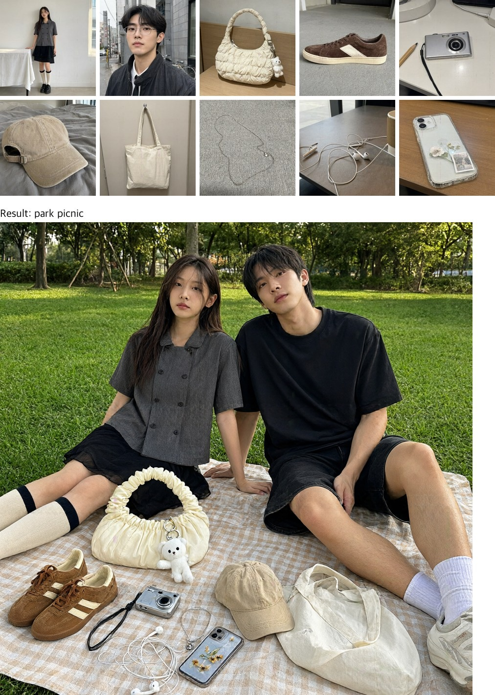

Figure 7 (DGX): Ten references (top) combined into one scene (bottom, seed 1). All ten made it in; six came through unchanged and four changed in part.

- **Scale and face resemblance trade off.** Seed 7 framed the people close, so their faces matched best, but the bag and keyring in front looked too big next to them. Seeds 1 and 777 framed them from farther away, so the sizes looked natural, but the man resembled his reference less. Figure 7 is seed 1, the most natural scene of the four seeds.
- **The glasses vanished every time.** With many references, small accessories go first.
- **By the numbers, the man in the ten-image scene became someone else.** Face similarity was 0.60\~0.65 for the woman in the three-image scene and 0.43 in the ten-image scene (seed 1). The man scored 0.17\~0.31 at all four seeds, overlapping the range for different people. Products scored 0.44\~0.56 (bag) and 0.40 (sneakers) in the three-image scene and 0.27\~0.65 in the ten-image scene, all above different products (0.16 or less). The order did not follow our verdicts, though: the phone (partial) scored 0.65 and the tote (preserved) 0.27. Worn or lying flat, an item changes shape and the number moves.

### 3.4 Photo retouching

Table 12: Photo retouching (DGX Spark, 1024², 40 steps, about 61 s per image)

| Edit | Intended change | Rest of image | Notes |
|---|---|---|---|
| Make the background of the man's photo white | Done at seed 7 | Unchanged | Same face, glasses, and clothes. At seed 42, which generated this photo, the background stayed and the image was oversaturated |
| Make the woman's photo brighter and warmer | Done at seed 7 | Unchanged | Only the light became warmer. Seed 42, which generated this photo, blew out the colors |
| Remove the pencil from the desk photo | Done at seed 7 | Unchanged | Removed even without a mark (Table 14). At seed 42, which generated this photo, the pencil's outline stayed |

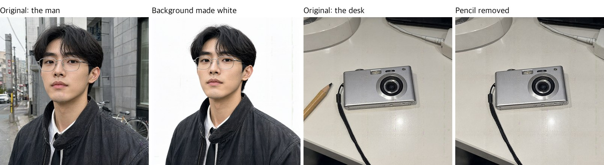

Figure 8 (DGX): Background replacement (1st and 2nd) kept the person intact. Pencil removal (3rd and 4th, seed 7) removed only the pencil.

**Edits marked with circles or paint** (DGX Spark). The model card says you can specify the area to change by drawing a circle or painting on the photo. We fed a photo with a red circle or a translucent red patch as the reference and put the instruction in the prompt. It uses the same input field as a single reference, so nothing extra is needed.

Table 13: Circle/paint-marked edits (1024², 40 steps. All on the DGX Spark. First three at seed 7, the face patches at seed 42)

| Mark | Instruction | Intended change | Rest of image | Notes |
|---|---|---|---|---|
| Red circle on the pencil | Remove the object in the circle | Done | Unchanged | The circle mark was removed too. At seed 42, which generated this photo, the pencil stayed |
| Red circle on the pencil | Replace it with a brass key | Done | Unchanged | A key sits where the pencil was |
| Cap painted red | Make it a navy corduroy cap | Done | Unchanged | Same bed and shadows |
| Three red dots on a face | A star-shaped pimple patch on each dot | Done | Unchanged | Small star patches on all three spots, no dots left. Freckles and skin texture intact |

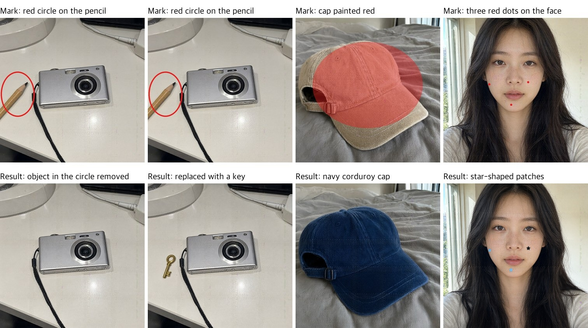

Figure 9: Top row is the marked input, bottom row is the result. All are from the DGX. In every case, the marked area changed and no mark remained. On the face, the left cheek and chin patches are pale blue and the right cheek one is black; each color was named in the prompt.

**Does it need the circle to remove the object?** We ran the same photo once without a mark and once with a red circle, at two seeds each.

Table 14: Pencil removal with and without a mark (DGX Spark, 1024², 40 steps)

| Condition | seed 42 | seed 7 |
|---|---|---|
| No mark | Outline left, oversaturated | Removed |
| Red circle | Stayed, oversaturated | Removed |

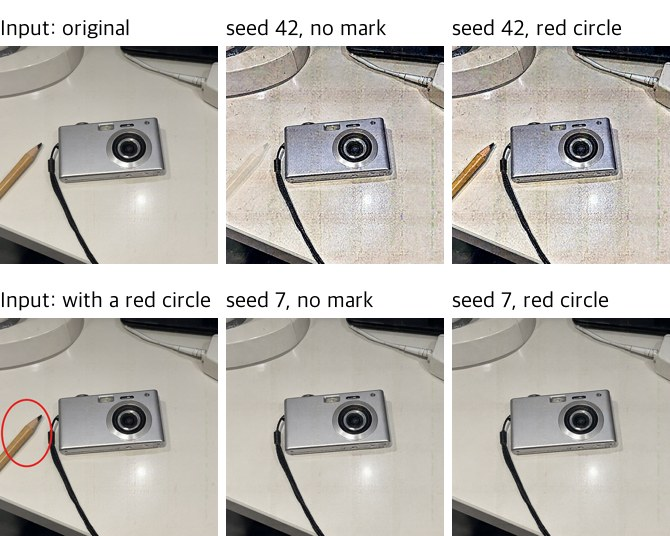

Figure 10 (DGX): The left two are the inputs (top: original, bottom: photo with a circle). The rest are results: top row seed 42, bottom row seed 7, each row with the unmarked run on the left and the circled run on the right.

- **It removed the object without a mark.** At seed 7 both runs removed the pencil cleanly. The desk photo was generated at seed 42, so the seed 42 runs reused its seed: both came out grainy and oversaturated, leaving the pencil's outline without the mark and the whole pencil with it.
- **The oversaturation comes from reusing the photo's seed.** The man's, woman's and desk photos were generated at seed 42, and every seed 42 edit of them was oversaturated, while seed 7 stayed close to the original saturation. The face photo was generated at seed 7, and its seed 42 edit came out clean.
- **The size of the mark sets the size of what you get.** The first face patches were marked with 30-pixel dots and came out big enough to cover a cheek. Shrinking the dots to 14 pixels gave patches the size of a fingernail. A mark carries size, not just position.
- **Asking for shape, color and count at once gets shaky.** Raising it to four patches and naming all four colors made one seed draw two stars and two pill shapes, and leave marks where nothing was marked.
- Circles and paint are useful for pointing at the area to change. But if the rest must stay untouched, generate a few images with different seeds and check.

### 3.5 Transparent background

We asked for stickers a select shop might use, on a transparent background: a round packaging seal ("VINTAGE SELECT / SEOUL") and a sale badge ("30% OFF").

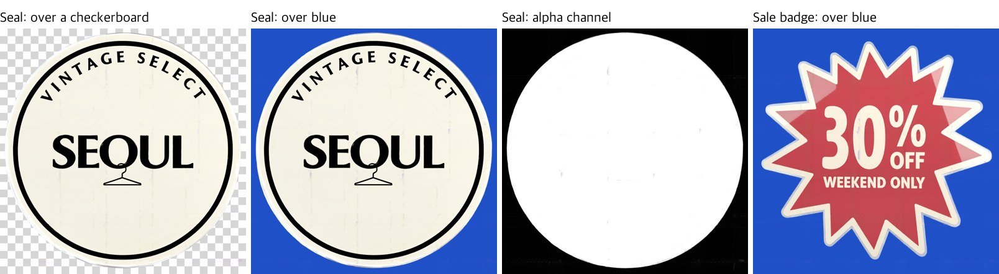

Figure 11 (4090): The left three are the same seal PNG over a checkerboard, over a blue background, and its alpha channel. The far right is the sale badge over a blue background, where the red face takes on the background color.

- **To the eye the background is transparent.** The checkerboard and the blue show through outside the seal, and the edge is clean. The English text was correct.
- **But the alpha outside is not exactly 0.** Outside the seal is 27.4% of the image, and only 12.3% of that is alpha 0. The rest is 1\~15, at most 6% opacity, so it is invisible. Tools that treat alpha 0 as background (auto cutout, some sticker apps) may keep a rectangular backdrop.
- **Sometimes the sticker itself lets the background through.** Only 1.6% of the seal's interior was alpha 240\~254, but 30.1% of the sale badge was. Its whole red face is slightly transparent, so over a blue background the color goes murky (Figure 11, right). Designs with large saturated areas need checking.
- **The transparency outside varies with the seed.** On another sticker, a different seed of the same prompt raised the mean alpha outside from 3.9 to 20.2 and left a faint rectangle over blue. For anything you will actually use, generate a few and check the alpha.

### 3.6 Fashion lookbook

Like an online store product page, we asked for a face close-up and front, side, and back full-body shots in one image. The model is a fictional woman with a bob, wearing a draped top, a wrap skirt, knee socks, and suede boots. We generated two seeds (7, 42) at 2048×1152, 40 steps on the DGX Spark.

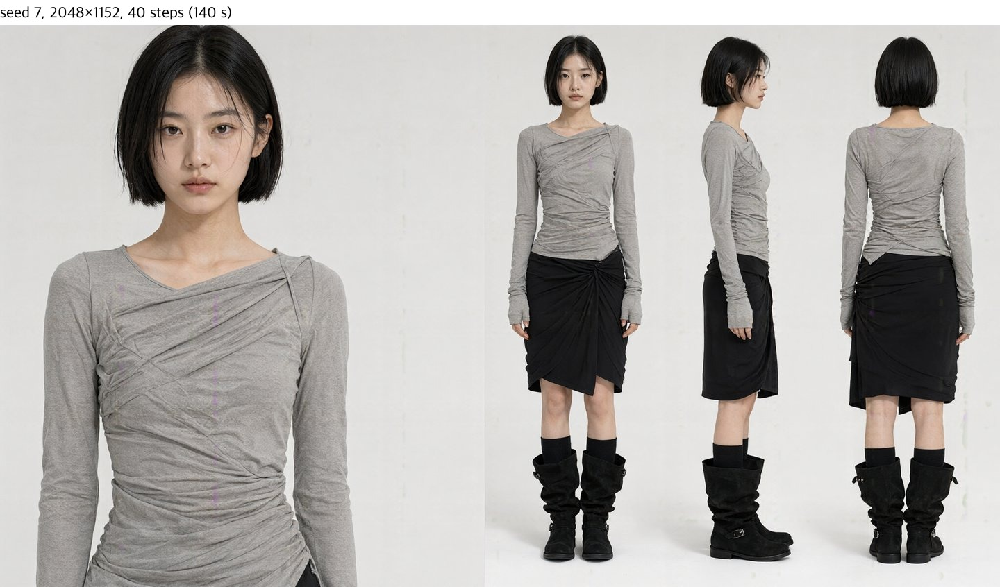

Figure 12 (DGX): Seed 7 lookbook. All four shots have the same face, bob, clothes, and shoes.

- **The four shots are one person.** The face and hair length, the top's asymmetric neckline, the long sleeves covering the back of the hand, and the boot buckles matched in all four shots. The skirt knot and hem in the back view also matched the front view.
- **Changing the seed changes the design (Figure 13).** With the same prompt, seed 42 produced an asymmetric midi skirt draping long to one side, with a visible shoulder strap. Seed 7 is an above-the-knee wrap skirt. The person, garment colors and materials, and boots were the same. This is usable for generating multiple design options.


Figure 13 (DGX): Same prompt and steps (40); only the seed differs. Left seed 7, right seed 42.

- One image took 129\~140 s. 20 steps (68 s) kept the same composition with fewer wrinkles (Figure 2).
- **Every compared image, including the 20-step one, had the vertical artifact.** A pink vertical line runs across the cheek with seed 42 and across the chest with seed 7 (Section 5, Figure 15). To use them as-is on a product page, zoom in, check, and fix.

## 4 Recommendations

- **Device**: For quick single images, use the DGX Spark or RTX 4090. A 16GB Mac runs the 4-bit conversion but takes around 20 minutes per image, so it is for testing only. On a Mac, refine prompts at 512² (4 min) and generate large images on another device.
- **Settings**: The recommended setting (2048², 40 steps) takes over 4 minutes per image on the DGX. Pick drafts at 1024², 20 steps (about 30 s) and regenerate only the chosen ones at the recommended setting. For scenes with many elements, check whether anything is missing at 20 steps.
- **References**: One reference is preserved well. If the reference or the photo to retouch was generated by this model, use a different seed from the one that generated it; reusing it copies the input, oversaturated. From three, people are preserved but product details (shoe shape) start to change. With ten, one image takes 10 minutes and a person may become someone else, so reduce the number of references when something must closely resemble its reference.
- **Text**: English and Chinese text is usable. Korean can get single characters wrong, and long handwriting in any language can drop a word or break down, so always zoom in and check. A character that comes out wrong stays wrong across seeds, so change the word instead. Small background text is unusable; add it later separately. For human-looking handwriting, turn on CFG and leave out instructions like "cross out and rewrite".

## 5 Limitations and what we did not measure

### Vertical artifact at fixed positions

In 1024² output, alpha dips slightly near columns x ≈ 438, 631, 824 (about 193 px apart) and row y ≈ 773, and a pink or purple line shows through there.

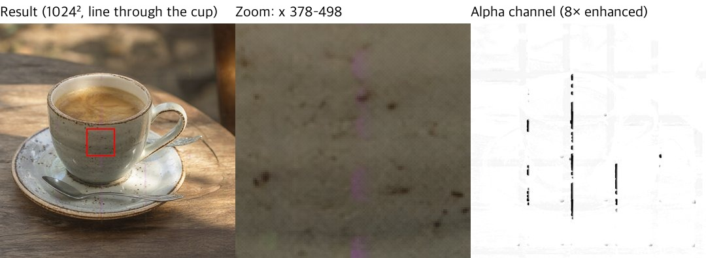

Figure 14 (4090): A pink vertical line through the middle of the cup (red box on the left, zoomed in the middle). The right shows the alpha channel enhanced 8×, with a seam visible in the same column.

Table 15: Variables changed

| Variable | Values tried | Result |
|---|---|---|
| seed | 42, 7, 1234, unspecified | Same column every time |
| Steps | 20, 40 | Same column, similar depth |
| CFG | 1.0, 4 + negative prompt | Remained in the same column |
| Device | DGX (aarch64), 4090 (x86, offload) | Same column |
| Invocation | HTTP API, web UI (gradio) | Same image |
| Prompt | Table 16 below | Strength varies |

Table 16: Depth of the alpha seam near column 438 (0 = none, 255 = fully transparent)

| Image | Depth | Appearance |
|---|---|---|
| Coffee cup (seed 42, 1234, unspecified) | 13\~19 | Continuous pink line |
| Lookbook, draped top (seeds 7 and 42, 20 and 40 steps) | 8.5\~10.0 | Pink line across the cheek or chest |
| Lookbook, knit cardigan (seed 42, 20 and 40 steps) | 3.6\~5.4 | Faint line on the cheek and neck |
| Rainy night street, cafe sign | 0.7\~0.9 | None |

- The same symptom has been reported upstream ([QwenLM/Qwen-Image-2.1 issue #5](https://github.com/QwenLM/Qwen-Image-2.1/issues/5), "purple vertical line smudge", no response). The issue author reports the line stayed bit-identical after changing VAE tiling, dtype, and decoding method, and suspects a stage before the decoder.
- This is a different defect from the 2-pixel fine grid known since the earlier Qwen-Image.
- **It also appears on faces.** In the 2048×1152 lookbook, the line appeared near the same column 438. The column position was the same even though the image width differed. It was present in nearly every lookbook image (Table 16), and crossed the face in the two seed 42 images.

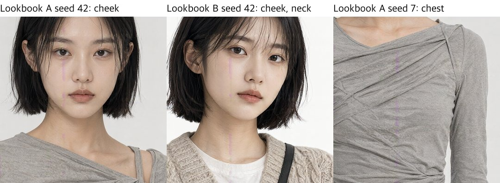

Figure 15 (DGX): The same column in three lookbook images. The left two cross the cheek and neck; the right crosses the chest of the top.

### Other limitations

- **Semi-transparent pixels appear even without requesting transparency.** Output is always an RGBA PNG, and about 2\~20% of pixels in ordinary images are semi-transparent. The background may show through where alpha is honored (web pages, editing tools).
- **Reusing a generated image's seed oversaturates the result.** When the reference or the photo to retouch was generated by this model, the run at the same seed and size copied it with oversaturation; changing the seed or the size made it go away (Sections 3.2 and 3.4). Every reference and retouched photo in this report was generated by this model, so we did not check whether photos taken with a camera are affected.
- We did not use the officially recommended prompt-rewriting model (9B). Local edits specified with a separate mask file could not be tested: the diffusers 2.1 pipeline has no mask input, and model-compose's inpaint supports only SDXL and FLUX. The compute-saving prefix KV cache was only measured switched on (the diffusers default), so its effect is unknown.
- We did not compare it with other models. This report only looks at whether this one model runs on your device and what it can do.
- The measurements only back up the visual verdicts. Korean CER is not reported because the OCR corrected wrong letters as it read, and a crossed-out word reads as 0%. Product regions were cropped by eye. Faces in the lookbook's full-body shots are too small for face similarity.
- Judgments were made by a single author, and sample sizes are small: 21 text prompts (the poster; the thank-you card, notice, notebook page and menu card in three languages; two reworded Korean notices; six short phrases. Only the short phrases and the Chinese notice have a single image), 6 transparent backgrounds (5 sticker designs, one of them at two seeds), 10 single-reference cases (5 subjects at two seeds) plus 12 reruns to check the seed cause (the same subjects at two more seeds, with a different photo of the woman, and two at 1152×896), 12 multi-reference cases (3 images at three seeds; 10 images in six runs with the original prompt plus three with edited prompts), 3 retouches, 4 circle/paint edits, 3 scenes for the step comparison, and 2 lookbook prompts. The tables in the body show only representative seeds.
- Mac results are from a third-party 4-bit conversion. The quality comparison with the original is only two images, and with one run each we do not know run-to-run time variance. Retouching and multiple references were not tested on the Mac. The conversion is still bound by the original's non-commercial license.

## License

| Covers | License | Commercial use |
| :---: | --- | :---: |
| This service | [`LICENSE`](LICENSE) | ✓ |
| `Qwen/Qwen-Image-2.1` weights | [Qwen Research License](https://huggingface.co/Qwen/Qwen-Image-2.1/blob/main/LICENSE) | ✗ |
| `circulus/Qwen-Image-2.1-bnb-4bit` (the 4-bit copy for Mac) | the same Qwen Research License as the original | ✗ |
