[English](README.md) · [한국어](README.ko.md) · [中文](README.zh-cn.md)

# image-generation-qwen-image-2.1

这个服务用文本提示词生成图像；给它一张参考照片，就能把其中的人物或商品放进新场景，或者修改这张照片。

Qwen-Image-2.1 用一个模型同时完成文生图和图像编辑。我们用 model-compose 部署它，并在 NVIDIA DGX Spark 和 RTX 4090 上运行。本报告只看这个模型能否在你的设备上运行、运行后擅长和不擅长什么，没有与其他模型比较。Apple M2 16GB 装不下原始权重，因此只确认了第三方 4 位量化权重能否运行。文字、参考图和编辑结果均由作者一人目视判定，同时测了文字错误率和与参考图的相似度。

## 目录

- [快速开始](#快速开始)
- [摘要](#摘要)
- [1 实验环境](#1-实验环境)
- [2 我的设备能跑吗](#2-我的设备能跑吗)
- [3 各功能结果](#3-各功能结果)
  - [3.1 文字渲染](#31-文字渲染)
  - [3.2 把 1 张参考图放进新场景](#32-把-1-张参考图放进新场景)
  - [3.3 多张参考图合成一个场景](#33-多张参考图合成一个场景)
  - [3.4 照片修图](#34-照片修图)
  - [3.5 透明背景](#35-透明背景)
  - [3.6 时装 Lookbook](#36-时装-lookbook)
- [4 建议](#4-建议)
- [5 局限与未测量的内容](#5-局限与未测量的内容)
- [许可证](#许可证)

## 模型

[`Qwen/Qwen-Image-2.1`](https://huggingface.co/Qwen/Qwen-Image-2.1) 是一个开放的图像模型，用同一套权重同时完成文生图和图像编辑。
它最多接受 10 张参考图，能在画面里写字，也能生成透明背景（RGBA）的图像。

## 演示


## 快速开始

需要 [model-compose](https://github.com/hanyeol/model-compose) 0.4.111 或更高版本。

用 [uv](https://docs.astral.sh/uv/) 安装：

```bash
uv pip install model-compose
```

或用 pip 安装：

```bash
pip install model-compose
```

克隆本仓库：

```bash
git clone https://github.com/MindrLabs/image-generation-qwen-image-2.1
cd image-generation-qwen-image-2.1
```

运行：

```bash
model-compose up
```

gradio 界面在 `http://localhost:8081` 打开，HTTP API 在 `http://localhost:8080/api` 打开。
用 `SERVER_PORT` 和 `PORT` 分别更改端口。

| 首次运行 | 做什么 |
| :---: | --- |
| 虚拟环境 | model-compose 在 `.venv/qwen-image` 建立环境，并安装 torch 和 diffusers main |
| 权重 | 下载 33 GB 的 `Qwen/Qwen-Image-2.1`。不需要 token，`HF_TOKEN` 只用于提高下载限速 |

`DEVICE` 默认为 `auto`：有 NVIDIA 显卡时选 CUDA，在 Mac 上选 MPS。
`cpu_offload: model` 已开启，所以 24 GB 显卡也能运行，需保留至少 50 GB 空闲系统内存。该设置只在 CUDA 上生效。
在 40 GB 以上的显卡上，去掉 `cpu_offload` 会更快：在 DGX Spark 上，带 1 张参考图的 1024²、40 步图像，保留该设置约需 4 分 20 秒，去掉后为 62.5 秒。下文 DGX Spark 的数据是在没有该设置的情况下测得的。
16 GB 的 Mac 放不下原始权重。把组件中的 `model` 换成第三方 4 位量化版本：

```yaml
  model:
    provider: huggingface
    repository: circulus/Qwen-Image-2.1-bnb-4bit
    token: ${env.HF_TOKEN | }
  quantization:
    type: nf4
    compute_dtype: bfloat16
    double_quant: false
```

由于 `max_concurrent_count: 1`，第二个请求要等第一个完成。

请求示例：

```bash
curl -o out.png localhost:8080/api/workflows/runs \
  -F workflow_id=generate -F wait_for_completion=true -F output_only=true \
  -F "input.prompt=A poster that says HELLO in bold letters" -F input.seed=42 \
  -F input.width=1024 -F input.height=1024 -F input.inference_steps=40
```

## 摘要

1. 在 DGX Spark 上，一张 1024² 图像 40 步耗时 54 秒，20 步耗时 28 秒。官方推荐设置（2048²，40 步）耗时 4 分 16 秒。16GB Mac 装不下原始权重（33 GB），但 4 位量化版（11.4 GB）可以运行，1024²、20 步一张需要 19 分钟。
2. 图中要求写的英文和中文几乎不出错。韩文短词句正确，但在手写和菜单卡上会有个别字的收音或元音被换掉。错哪个字由措辞决定：换 seed、换机器，同一个字都以同样的方式出错，只有改换措辞才能纠正。7 行手写笔记本在三种语言中都不稳定。未要求的背景文字全是假字。
3. 把 1 张参考图放进新场景时，人物和商品保持得很好。如果参考图是用本模型生成的，不要再用生成它的 seed：用那个 seed 时，模型没有生成新场景，而是过饱和地照搬了参考图；换成其他 seed 都生成了新场景。修图也一样，换用其他 seed 时，换背景和调色都很干净。在照片上画圈或涂色来标出修改位置的编辑也可行。
4. 把 10 张参考图放进一个场景时，10 件全部出现，其中一部分相似度下降（保持 6、部分 4）。一张约需 10 分钟。
5. 部分图像在固定位置出现淡粉色竖线。改变设置也不会消失，我们认为是模型本身的缺陷。

表 1：各设备概况

| 设备 | 能否运行 | 1024² 40 步一张 | 内存 |
|---|---|---|---|
| Apple M2 16GB | 4 位量化版可运行 | 未测（20 步 19 分钟） | 13 GB（1 张参考图时 17 GB，发生交换） |
| RTX 4090 24GB | 可运行（需要 CPU offload） | 约 45 秒（手动发送 3 次） | 显存 19.8 GB，系统内存 45 GB |
| DGX Spark | 可运行 | 54 秒 | 31.6 GB |

## 1 实验环境

表 2：测量设备

| 设备 | 加速器 | 内存 | 条件 |
|---|---|---|---|
| DGX Spark | GB10，驱动 580.126.09，CUDA 13.0 | 120 GB 统一内存 | 共用。在剩余内存约 93 GB 时测量 |
| RTX 4090 工作站 | RTX 4090 一张 | 24 GB | `cpu_offload: model` |
| MacBook（Apple M2） | MPS | 16 GB 统一内存 | 关闭浏览器后测量。开始前已占用 4 GB 交换空间 |

- 软件：model-compose upstream `5e82e0e3`（2026-09-21）、diffusers 0.41.0.dev0、transformers 5.17.0、bf16。torch 在 DGX 上为 2.13.0 cu130（aarch64），4090 上为 2.14.0 cu126，Mac 上为 2.14.0（MPS）。只有 Mac 额外使用了 bitsandbytes 0.50.2。
- 权重为 `Qwen/Qwen-Image-2.1` 修订版 `790c9263`。只有 Mac 使用了第三方 4 位（nf4）量化版 `circulus/Qwen-Image-2.1-bnb-4bit`。
- DGX 的文生图速度按每个条件用同一 seed（42）各跑 2 次测量，并去掉服务器启动后的第一个请求。
- 参考图、编辑和 4090 的数据来自直接发给服务器的请求。
- 数值指标：文字用 Qwen2.5-VL-7B 读出后计算字符错误率（CER）。与参考图的相似度用余弦相似度，人物用 InsightFace（antelopev2），商品只裁出商品部分用 DINOv2-base。
- 默认设置为 1024²、40 步、`true_cfg_scale` 1.0（CFG 关闭）。CFG 让图像更严格地遵循提示词，开启后每步计算两次，速度变慢。
- 参考图全部是事先用本模型生成的虚构人物和商品，没有使用真实人物照片。

4090 和 DGX 的权重与精度（bf16）相同，因此我们认为可以把两者的质量判定放在一起。但设备不同时，即使 seed 相同也会生成不同的图像，所以要复现图像必须在各图表标注的设备上运行。

## 2 我的设备能跑吗

表 3：DGX Spark 每张生成时间（中位数，经由服务器）

| 分辨率 | 20 步 | 40 步 | 峰值内存 |
|---|---|---|---|
| 1024² | 28.3 秒 | 54.1 秒 | 31.6 GB |
| 2048²（官方推荐） | 2 分 14 秒 | 4 分 16 秒 | 33.7 GB |

**步数与 seed。** 该模型从随机噪声出发，一点点去除噪声来生成图像。去除一次的过程就是 1 步。步数越多越慢，但细节越丰富。耗时几乎与步数成正比，默认为 40。seed 是决定初始噪声的编号。在同一设备上给同一个 seed，会得到完全相同的图像。在 DGX 上，所有条件下两次生成的文件连字节都完全一致。设备不同时，即使 seed 相同也会得到不同的图像。

- 分辨率提高一倍（像素四倍），耗时约为 4.7 倍。
- 启动服务器并加载模型约需 3 分钟。
- 相同条件下的重复运行几乎没有波动（1024²、20 步 4 张为 28.2\~28.3 秒）。

表 4：按参考图张数的生成时间（1024²，40 步）

| 参考图 | DGX Spark | RTX 4090 |
|---|---|---|
| 无 | 54 秒 | 约 45 秒（3 次） |
| 1 张 | 62.5 秒 | 48.5 秒（8 次） |
| 3 张 | 184 秒 | 未测 |
| 10 张 | 598 秒 | 未测 |

- **RTX 4090**：20 步为 35 秒，开启 CFG（`true_cfg_scale` 4）为 65 秒。这些只来自少量请求，不如重复测量精确。

### CPU offload 与内存

能在 24 GB 显卡上运行，靠的是 CPU offload。它在显存上省下的，会从系统内存里拿走。

offload 平时把权重放在 CPU 内存里，只把轮到计算的那部分搬到 GPU。

**`cpu_offload: model` 会把文本编码器、图像模型和 VAE 整个整个地搬上搬下。** 因此显存降到最大的那一块的大小，而全部权重留在系统内存里。搬运发生在每个阶段一次，而不是每一步一次，所以速度损失很小。4090 开着 offload 仍比 DGX 快，原因应是它的内存带宽（1,008 GB/s 对 273 GB/s）和算力更高。

表 5：各设置的内存占用

| 设备与设置 | GPU 内存 | 系统内存 |
|---|---|---|
| RTX 4090 24GB，`cpu_offload: model` | 19.8 GB | 工作进程占 45 GB |
| DGX Spark，不用 offload | 统一内存 31.6 GB | 统一内存，同一块 |
| Apple M2 16GB，4 位 | 统一内存 13 GB（1 张参考图时 17 GB） | 同一块内存，交换 10\~12 GB |

### 减少步数会失去什么

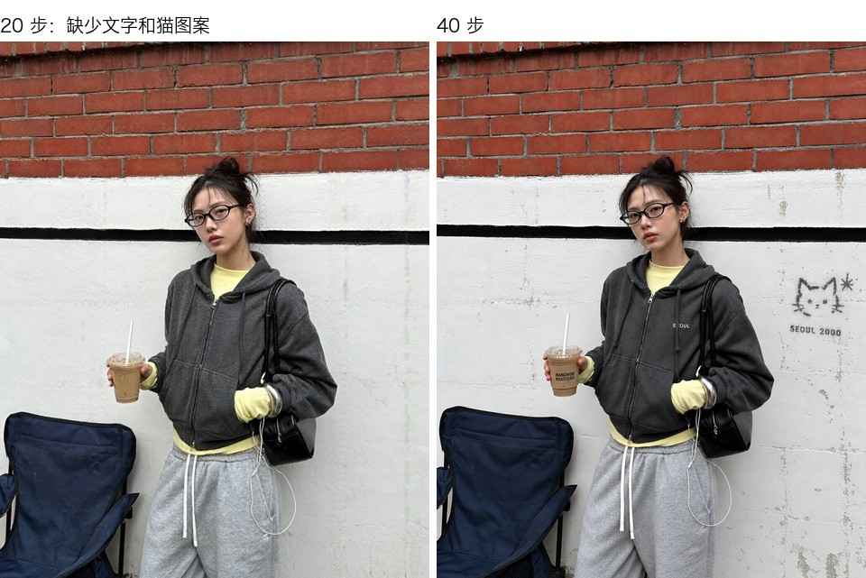

图 1（DGX）：同一提示词和 seed（42），20 步（左）与 40 步（右）。

| 场景 | 20 步 | 40 步 |
|---|---|---|
| 咖啡杯与可颂 | 构图和质感与 40 步几乎相同 | 稍微更清晰 |
| 首尔小巷街拍 | 构图、人物、服装相同。提示词中的杯套文字"MANGWON ROASTERS"、胸前的"SEOUL"和墙上的猫图案全部缺失 | 三个元素都出现了 |
| 时装 Lookbook（2048×1152，图 2） | 构图、姿势、服装形状相同。上衣褶皱和裙结周围的抽褶较少，布料显得平滑 | 褶皱和抽褶更多、更清晰 |

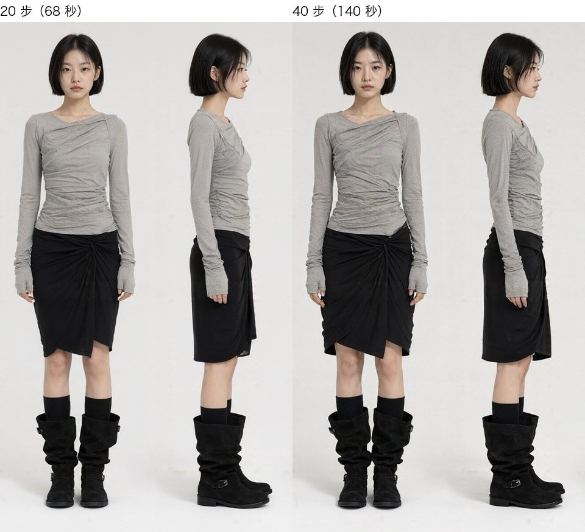

图 2（DGX）：同一 seed（7）Lookbook 的正面与侧面全身。20 步（左）耗时 68 秒，40 步（右）耗时 140 秒。

20 步耗时减半。即使构图相同，文字或小图案等提示词元素也可能缺失；在服装这类注重质感的图中，褶皱等细节会减少。

### 16GB Mac 用 4 位可以运行

把原始权重量化到 4 位，33 GB 缩小为 11.4 GB（文本编码器 6.7、图像模型 4.0、VAE 0.7）。我们用 model-compose 部署了这个量化版。

表 6：Apple M2 16GB 与 DGX Spark 对比（1024²，20 步，seed 42，各一张）

| 任务 | Mac 4 位 | DGX 原始 | Mac 内存 |
|---|---|---|---|
| 文生图 | 1142 秒（19 分钟） | 31 秒 | 13 GB |
| 1 张参考图 | 1627 秒（27 分钟） | 35 秒 | 17 GB |
| 参考：512² 文生图 | 226 秒（4 分钟） | 未测 | 13 GB |

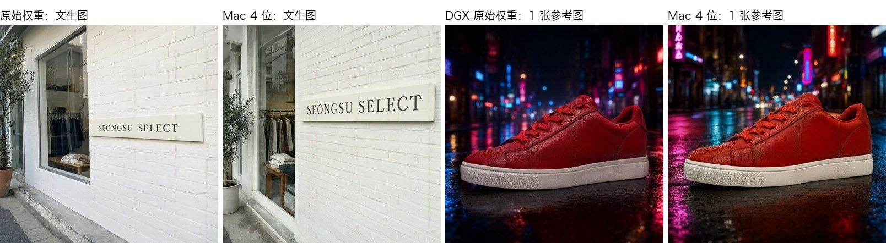

图 3：比较原始权重与 Mac 4 位的文生图（第 1·2 张）和 1 张参考图（第 3·4 张）。招牌一组是 4090 原始权重（36 秒）对 Mac 4 位（1011 秒），运动鞋一组是 DGX 原始权重对 Mac。设备不同时，即使 seed 相同构图也会不同。

- **两台设备的文字都正确。** 英文招牌"SEONGSU SELECT"在原始权重和 Mac 4 位上都写全了 13 个字符，放大后笔画也没有断裂。一行大字能扛住 4 位量化。各只有一张，更难的文字能不能扛住还说不好。
- 两台设备上运动鞋的鞋底、鞋带和皮革质感都与参考图几乎相同。
- **慢的原因是内存。** 模型占用 13 GB，加入参考图后增至 17 GB，超过 16 GB 内存。交换空间升到约 10\~12 GB。每步耗时文生图约 55 秒，1 张参考图约 78 秒。
- [upstream issue #6](https://github.com/QwenLM/Qwen-Image-2.1/issues/6) 报告在 Mac（MPS）上 512² 以上的输入图像会被悄悄损坏，结果发灰发平。本次 1 张参考图中运动鞋的颜色和质感与原图几乎相同，没有出现这个症状。

## 3 各功能结果

表 7：按问题整理的结果

| 问题 | 结果 |
|---|---|
| 能把图中的文字写对吗 | 英文和中文几乎全对。韩文短词句正确，但手写和菜单卡会错 1\~5 个字。写错的字换 seed 也不变，只有改换措辞才能纠正。未要求的小字用假字填充 |
| 把我照片中的人物、商品放进其他场景还能保持吗 | 保持得很好。如果参考图是本模型生成的，再用它的 seed 会过饱和地照搬参考图；换其他 seed 即可 |
| 合成多张图能做到什么程度 | 10 张都能放进去。张数越多相似度越低 |
| 能修图吗 | 只要避开生成该照片的 seed，换背景和调色都可以。用圆圈或涂色标出修改位置的编辑也可以 |
| 能直接输出透明背景 PNG 吗 | 目视可以。以 alpha 是否精确为 0 来裁切的工具可能会残留背景 |
| 像网店 Lookbook 那样，多个镜头中人物和服装能保持一致吗 | 同一张图中的四个镜头（特写、正面、侧面、背面）保持一致。2K 一张约 2 分钟 |
| 同一 seed 会得到同一张图吗 | 同一设备上完全相同 |
| 可以商用吗 | 不可以。Qwen Research License 只允许研究和评估用途 |

### 3.1 文字渲染

我们把四个日常场景分别用韩文、英文和中文各生成了一遍：快递箱里的手写感谢卡片、服装店试衣间的手写须知、一页手写笔记本和品鉴菜单卡。都像用手机随手拍下的照片，采用官方推荐的 3:4（1792×2400），各用两个 seed（42、7）生成。只有英文的大学校园节海报也用同样的方式生成。另有 6 条短词句（韩文 3 条、英文 3 条）以 1024² 各生成一张。

表 8：用三种语言生成的场景（DGX Spark，40 步）

| 场景 | 韩文 | 英文 | 中文 |
|---|---|---|---|
| 手写感谢卡片（6 行） | 两张都只错了"언제든"：seed 42 把 제 写成 세，seed 7 的"든"少了一横（ㅡ） | 正确 | 正确 |
| 手写试衣间须知（8 行） | "피팅룸 안내"这一措辞在两个 seed 和 4090 共三张图中都错了同样的 5 个字（룸 → 룽、번 → 반、밖 → 박、이번 → 이반、랙 → 택）。去掉这些词后的措辞正确 | 正确 | 正确（只生成了 seed 42 一张） |
| 手写笔记本（7 行） | seed 7 错 1 处（짧），seed 42 错 2 处（짧、것 → 깃） | seed 42 把要求的一个词（"every"）划掉后没有重写。seed 7 正确，但行间有淡淡的假字 | seed 42 把要求的"满"划掉后没有重写。seed 7 从第三行开始崩坏 |
| 品鉴菜单卡（五道菜） | 英文行正确。"솥밥"两张都写成了"솔밤"，seed 7 还把"갈비찜"写成了"갈비점" | 正确 | 正确 |


图 4（DGX）：从左到右依次为韩文、英文、中文。上排是手写感谢卡片（韩文和中文 seed 7，英文 seed 42），下排是菜单卡（seed 42）。韩文卡片的"언제든"和菜单的"솥밥"写错了，英文和中文全部正确。

- 判定只看要求的词句。未要求的小字（T 恤、旁边的传单、背景显示器、图例）在所有图像中都被填充成假字。有一块招牌甚至把提示词里的"写着"一词画成了乱码。
- **英文和中文几乎不出错。** 海报的 8 处和 3 条英文短词句（面包店招牌、蜂蜜瓶标签、幻灯片）全部正确。卡片、须知和菜单卡在两种语言中也都正确，出错的只有手写笔记本。
- **韩文的错法是某个字的收音或元音被换掉。** 3 条韩文短词句（咖啡馆招牌、地铁指示牌、书的封面）正确，但较长的文字会错一两个字。错哪个字由措辞决定。"피팅룸 안내"这一措辞换 seed、换机器，都以同样的方式错同样的 5 个字；手写感谢卡片也不论 seed，只错在"언제든"上。所以写错的字换 seed 纠正不了，只能改换用词。
- **手写笔记本在三种语言中都不稳定。** 英文和中文里被划掉的词，来自提示词中"划掉一个词再重写"的指示：模型只划掉，没有重写。不要加这类指示。
- **要让手写像真人写的，需要开启 CFG。** 要求"工整的手写"会像字体。改成"匆忙的手写"看起来像人写的，但有时会从中途崩坏。加上 CFG 4 和负面提示词（"字体、打印文字"）后，大多能读到最后（中文笔记本 seed 7 除外），但每张从 4 分 25 秒增至 8 分 30 秒。图 4 的手写感谢卡片使用这一设置。
- **OCR 也印证了这一点。** 目视判定正确的英文和中文卡片、须知、菜单卡、海报和短词句，字符错误率全部为 0%。笔记本中英文 seed 7 为 4.4%，崩坏的中文 seed 7 为 9.8%。被划掉的词字形还在，所以算成 0%。韩文没有列出数值：OCR 会把写错的字读成原本的词（两张手写卡片的"언제든"都是 0%）。

### 3.2 把 1 张参考图放进新场景

参考图是两个人物（穿炭灰色衬衫的女性、戴眼镜男性）和三件物品（米色抽褶单肩包、棕色绒面运动鞋、银色卡片数码相机）。全部是本模型生成的图（包用 seed 7，其余用 seed 42）。

表 9：1 张参考图（DGX Spark，1024²，40 步，seed 42 与 7）

| 参考图 | 新场景 | 判定 | 备注 |
|---|---|---|---|
| 穿炭灰色衬衫的女性 | 在咖啡馆窗边看书 | seed 7 保持 | 脸、长发、衬衫和裙子相同。生成参考图的 seed 42 崩坏 |
| 戴眼镜男性 | 夜晚地铁里抓着扶手 | seed 7 保持 | 脸、眼镜、头发相同。生成参考图的 seed 42 崩坏 |
| 抽褶单肩包 | 挂在户外咖啡座椅背上 | seed 42 保持 | 米色、褶皱、小熊挂件相同。生成参考图的 seed 7 崩坏 |
| 绒面运动鞋 | 低头俯拍的斑马线 | seed 7 部分 | 颜色和材质相同，但"有人穿着"没有实现。生成参考图的 seed 42 崩坏 |
| 卡片数码相机 | 黄昏的江边野餐 | seed 7 保持 | 机身、镜头圈、腕带相同。生成参考图的 seed 42 崩坏 |

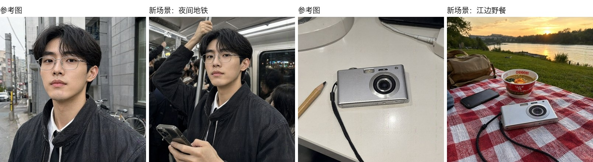

图 5（DGX）：参考图（第 1·3 张）与放进新场景的结果（第 2·4 张）。

- **再用生成参考图的 seed，就会照搬参考图。** 用生成参考图的 seed 跑出的图，全都照搬了参考图的构图和背景，并像过度 HDR 一样过饱和；用其他 seed 的全都生成了新场景。用 seed 123 和 1234 重跑同样的参考图，全部生成了新场景；保留失败的 seed、只把输出改为 1152×896，也生成了新场景。上游也报告了同样的现象（[issue #9](https://github.com/QwenLM/Qwen-Image-2.1/issues/9)）：用同一 seed、同一分辨率编辑生成的图，结果会失真。
- **在生成参考图的 seed 上提示词几乎不起作用。** 把这些图只改提示词末句为"完全是新地点的新照片"后重跑，结果与原图的逐像素平均差只有 0.6\~1.1/255。
- **数值也印证了这一点。** 与参考图的人脸相似度，男性 0.84，女性 0.49；本模型生成的其他女性与她之间为 0.29\~0.42，女性与男性为 0.14。商品：包 0.94、相机 0.88、运动鞋 0.49（俯拍，所以较低）。不同商品之间在 0.16 以下。崩坏后照搬参考图的图更高，为 0.84\~0.96，所以仅靠相似度无法识别崩坏。

### 3.3 多张参考图合成一个场景

**3 张**（DGX Spark，seed 7·123）。提示词为"第 1 张图中的女性坐在公园长椅上，肩上挎着第 2 张图中的包，穿着第 3 张图中的运动鞋"，并写明每件物品的颜色、材质、形状，要求保持不变。

表 10：3 张合成（换 seed 判定相同）

| 参考图 | 结果 | 判定 |
|---|---|---|
| 穿炭灰色衬衫的女性 | 脸、长发、衬衫和黑色裙子相同 | 保持 |
| 抽褶单肩包 | 米色、褶皱和小熊挂件都相同，只是包带跨过手臂，手臂消失在包后面 | 保持 |
| 绒面运动鞋 | 棕色绒面和米色鞋底相同，侧面的宽斜条变成了三条细条 | 部分 |

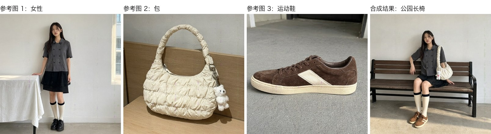

图 6（DGX）：合成 3 张参考图（第 1\~3 张）的结果（第 4 张，seed 7）。

- **写明物品特征才能保持。** 只用"第 2 张图中的包"这样的编号指代时，包变成了黑色皮质单肩包，运动鞋变成了白色厚底鞋。写明颜色、材质、形状后，恢复成了原来的物品。
- **人拿着物品的姿势不自然。** seed 7 的包带跨过手臂，手臂消失在包后面（图 6）；seed 123 斜挎着把包夹在腋下。物品的样子保持住了，佩戴方式却不自然。

**10 张**（DGX Spark，模型卡所述上限，从 seed 1、7、2024、777 中选了 seed 1）。提示词为"公园野餐，第 1 张图的女性和第 2 张图的男性坐在毯子上，毯子上放着第 3\~10 张图的物品"，同样写明了每件物品的特征。

表 11：10 张合成（seed 1，每张约 10 分钟）

| 参考图 | 判定 | 备注 |
|---|---|---|
| 穿炭灰色衬衫的女性 | 保持 | 脸、长发、两排纽扣、黑色裙子、罗纹长袜都相同 |
| 戴眼镜男性 | 部分 | 眼镜消失，衬衫和领带变成了黑色 T 恤。头部倾斜，脸型略显柔和 |
| 抽褶单肩包 | 部分 | 米色、银色扣环、小熊挂件相同，但鼓起的绗缝纹理消失，变成了平淡的抽褶包，挂件相对包也变大了 |
| 绒面运动鞋 | 部分 | 颜色和材质相同，侧面的宽斜条变成了两条，米色鞋底变成了棕色 |
| 卡片数码相机 | 保持 | 机身、镜头圈、腕带相同 |
| 水洗棒球帽 | 保持 | 颜色和弯帽檐相同 |
| 帆布托特包 | 保持 | 颜色和两条长提手相同。平放在野餐垫上，形状显得松软 |
| 银色细链项链 | 保持 | 细链和圆形吊坠相同，吊坠略显凹凸 |
| 有线耳机 | 保持 | 耳塞和线材相同 |
| 透明壳手机 | 部分 | 手机壳和摄像头形状相同，但一朵白花和照片卡变成了几朵黄色小花 |

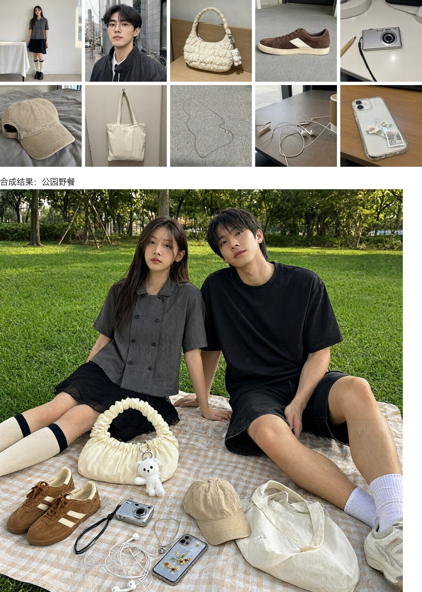

图 7（DGX）：把 10 张参考图（上）合成到一个场景的结果（下，seed 1）。10 件全部出现，其中 6 件原样保留，4 件局部改变。

- **尺寸感与面部相似度此消彼长。** seed 7 把人物拍得近，脸最像，但放在前面的包和挂件相对人物显得过大。seed 1、777 拍得远，尺寸自然，但男性的脸不太像。图 7 是四个 seed 中场景最自然的 seed 1。
- **眼镜每次都消失。** 参考图一多，人物身上的小配件最先丢失。
- **从数值看，10 张合成中的男性变成了另一个人。** 人脸相似度：3 张合成中的女性为 0.60\~0.65，10 张（seed 1）中的女性为 0.43。10 张中的男性在四个 seed 下都是 0.17\~0.31，与不同人之间的数值重叠。商品在 3 张合成中包为 0.44\~0.56、运动鞋为 0.40，在 10 张中为 0.27\~0.65，都高于不同商品之间（0.16 以下）。但顺序与目视判定不一致：手机（部分）为 0.65，托特包（保持）为 0.27。背在身上或平放时形状会变，数值也随之波动。

### 3.4 照片修图

表 12：照片修图（DGX Spark，1024²，40 步，每张约 61 秒）

| 修图 | 目标变化 | 其余部分 | 备注 |
|---|---|---|---|
| 把男性照片的背景换成白色 | seed 7 完成 | 不变 | 脸、眼镜、衣服相同。生成该照片的 seed 42 背景没变且过饱和 |
| 把女性照片调亮调暖 | seed 7 完成 | 不变 | 只有光线变暖。生成该照片的 seed 42 颜色溢出 |
| 去除书桌照片中的铅笔 | seed 7 完成 | 不变 | 不加标记也能去除（表 14）。生成该照片的 seed 42 留下了铅笔轮廓 |

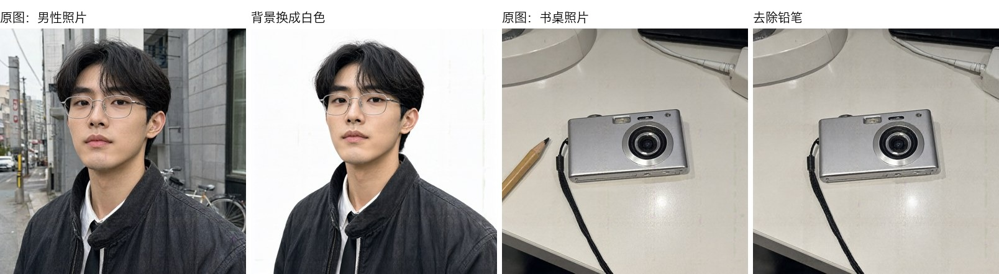

图 8（DGX）：换背景（第 1·2 张）保持了人物。去除铅笔（第 3·4 张，seed 7）只去掉了铅笔。

**用圆圈或涂色标记的编辑**（DGX Spark）。模型卡称可以在照片上画圈或涂色来指定修改位置。我们把画了红圈或涂了半透明红色的照片作为参考图输入，指令写在提示词里。它与 1 张参考图用同一个输入字段，不需要额外输入。

表 13：圆圈·涂色标记编辑（1024²，40 步。全部在 DGX Spark。前三例 seed 7，脸部贴纸 seed 42）

| 标记 | 指令 | 目标变化 | 其余部分 | 备注 |
|---|---|---|---|---|
| 铅笔上画红圈 | 去除圈内的物体 | 完成 | 不变 | 圆圈痕迹也消失了。生成该照片的 seed 42 铅笔还在 |
| 铅笔上画红圈 | 换成一把黄铜钥匙 | 完成 | 不变 | 铅笔的位置换成了钥匙 |
| 棒球帽涂红 | 换成藏青色灯芯绒帽 | 完成 | 不变 | 床和阴影相同 |
| 脸上三个红点 | 每个红点处贴一枚星形祛痘贴 | 完成 | 不变 | 三处都贴上了小星形贴，没有留下红点。雀斑和皮肤质感也保持原样 |

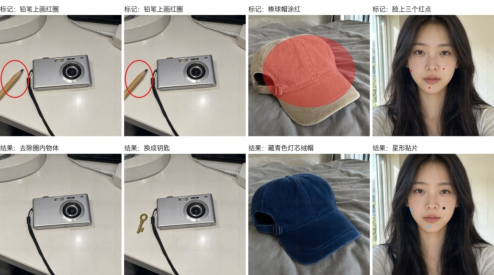

图 9：上排是画了标记的输入，下排是结果。全部来自 DGX。所有标记处都发生了变化，且没有留下标记痕迹。脸上左颊和下巴是淡蓝色、右颊是黑色贴纸。每个点的颜色都在提示词里指定。

**一定要画圈才能去除吗。** 用同一张照片分别在不加标记和画红圈两种条件下各跑两个 seed。

表 14：去除铅笔，有无标记对比（DGX Spark，1024²，40 步）

| 条件 | seed 42 | seed 7 |
|---|---|---|
| 无标记 | 留下轮廓，过饱和 | 已去除 |
| 红圈 | 仍在，过饱和 | 已去除 |

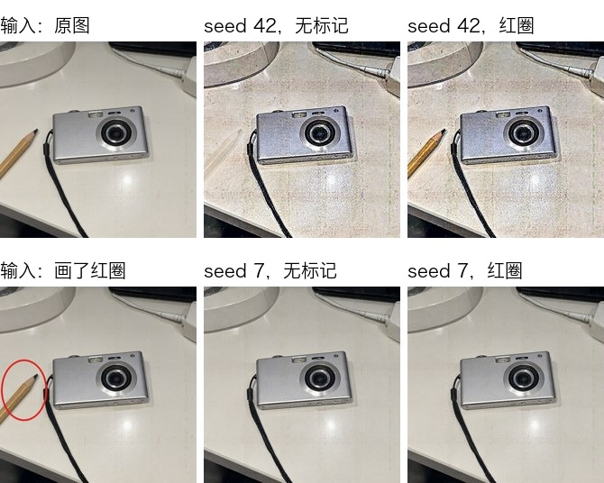

图 10（DGX）：左边两张是输入（上为原图，下为画圈的照片）。右边是结果：上排 seed 42，下排 seed 7，每排左为无标记、右为红圈。

- **不加标记也能去除。** seed 7 下两种情况都干净地去除了铅笔。书桌照片是用 seed 42 生成的，所以 seed 42 相当于重用了照片的 seed：两张都变得粗糙、过饱和，无标记时留下铅笔轮廓，画圈时整支铅笔都还在。
- **过饱和来自重用照片的 seed。** 男性、女性和书桌照片都是用 seed 42 生成的，用 seed 42 编辑时全部过饱和，seed 7 则接近原图的饱和度。用 seed 7 生成的脸部照片，用 seed 42 编辑也很干净。
- **标记的大小决定结果的大小。** 脸部贴纸最初用直径 30 像素的圆点标记，结果贴纸大到能盖住半边脸颊。把圆点缩到直径 14 像素后，贴纸就只有指甲大小。标记传达的不只是位置，还有大小。
- **同时要求形状、颜色和数量就会不稳。** 把贴纸增加到 4 枚并指定四种颜色后，有一个 seed 画成了两颗星加两个药丸形，还在没有标记的地方留下了痕迹。
- 圆圈和涂色用来指出修改位置是可行的。但如果其余部分必须保持不变，就换几个 seed 多出几张再确认。

### 3.5 透明背景

我们请求生成买手店会用的贴纸，背景透明：贴在包装上的圆形封签（"VINTAGE SELECT / SEOUL"）和促销徽章（"30% OFF"）。

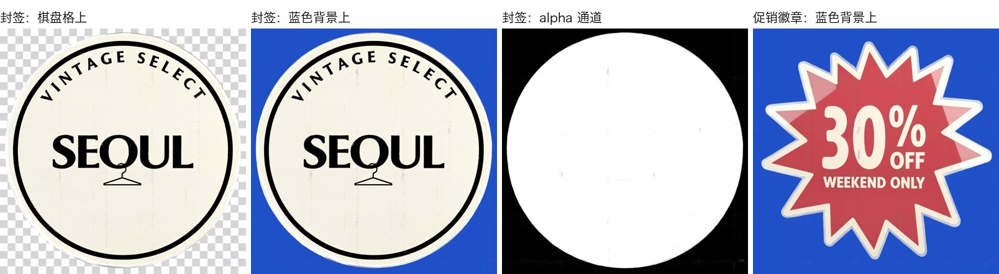

图 11（4090）：左边三张是同一个封签 PNG 叠在棋盘格上、蓝色背景上的样子以及它的 alpha 通道。最右边是促销徽章叠在蓝色背景上，红色面被背景色染了。

- **肉眼看背景是透明的。** 封签之外能看到棋盘格和蓝色，边缘也干净。英文文字也正确。
- **但外侧的 alpha 并不正好是 0。** 封签外侧占整幅的 27.4%，其中 alpha 为 0 的只有 12.3%。其余是 1\~15，不透明度不超过 6%，肉眼看不出来。把 alpha 是否为 0 当作背景判据的工具（自动抠图、部分贴纸应用）可能会留下一个矩形背景。
- **有时贴纸本身也会透出背景。** 封签内部只有 1.6% 是 alpha 240\~254，促销徽章却有 30.1%。它整块红色面都略微透明，叠在蓝色背景上颜色会发浑（图 11 右）。色块大、饱和度高的图案需要检查。
- **外侧的透明度随 seed 变化。** 在另一张贴纸上，同一条提示词换个 seed 就把外侧 alpha 均值从 3.9 抬到 20.2，叠在蓝色上能看到淡淡的矩形。真要使用时，多生成几张并检查 alpha。

### 3.6 时装 Lookbook

仿照网店详情页，要求在一张图中放入脸部特写和正面、侧面、背面全身。人物是虚构的短发女性，服装为垂坠上衣、裹身裙、过膝袜和麂皮靴。在 DGX Spark 上以 2048×1152、40 步生成了两个 seed（7、42）。

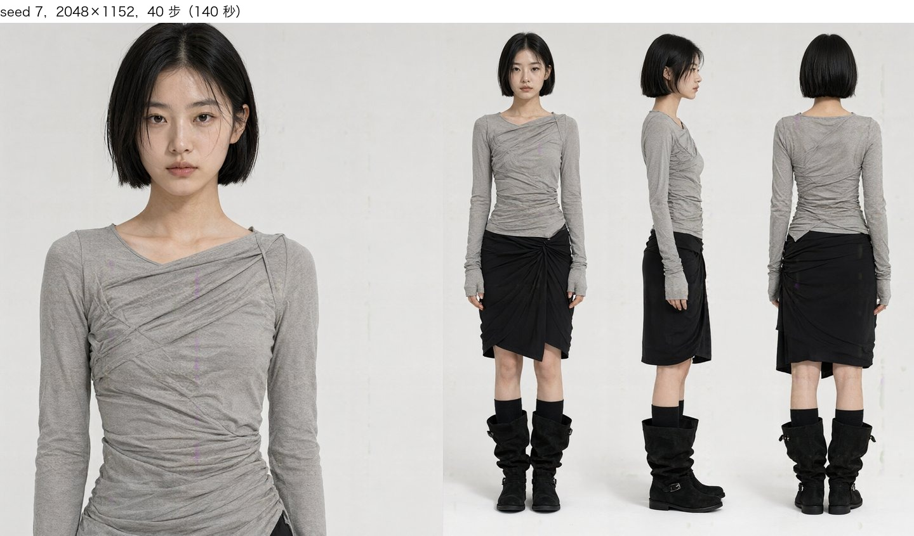

图 12（DGX）：seed 7 的 Lookbook。四个镜头的脸、短发、衣服、鞋子都相同。

- **四个镜头是同一个人。** 脸和发长、上衣的不对称领口、盖住手背的长袖、靴子扣环在四个镜头中都一致。背面的裙结和下摆也与正面吻合。
- **换 seed 会改变设计（图 13）。** 同一提示词下，seed 42 生成的是一侧长长垂下的不对称中长裙，并露出肩带。seed 7 是膝上裹身裙。人物、服装颜色与材质、靴子相同。可用于生成多个设计方案。


图 13（DGX）：提示词和步数（40）相同，只有 seed 不同。左 seed 7，右 seed 42。

- 一张耗时 129\~140 秒。20 步（68 秒）构图相同，只是褶皱减少（图 2）。
- **包括 20 步在内，对比的图全部都有竖线缺陷。** seed 42 在脸颊、seed 7 在胸前有粉色竖线穿过（第 5 章图 15）。若要直接用于商品页面，需要放大检查并修复。

## 4 建议

- **设备**：想快速出一张图，用 DGX Spark 或 RTX 4090。16GB Mac 用 4 位量化版能运行，但一张需要 20 分钟左右，只适合测试。在 Mac 上最好用 512²（4 分钟）打磨提示词，大图在其他设备上生成。
- **设置**：推荐设置（2048²，40 步）在 DGX 上一张超过 4 分钟。最好先用 1024²、20 步（约 30 秒）挑选草稿，只把选中的用推荐设置重新生成。元素较多的场景要检查 20 步时是否有缺失。
- **参考图**：1 张保持得很好。如果参考图或要修的照片是本模型生成的，要换一个与生成它不同的 seed，用同一个 seed 会过饱和地照搬输入。从 3 张起，人物能保持，但商品细节（鞋型）开始变化。10 张时一张需要 10 分钟，人物还可能变成另一个人，所以如果有必须相像的对象，应减少参考图数量。
- **文字**：英文和中文词句可以使用。韩文可能写错个别字，长篇手写不论哪种语言都可能漏词或崩坏，务必放大检查。写错的字换 seed 也不会变，应改换用词。背景小字无法使用，应事后另行加入。要让手写像真人写的，请开启 CFG，并且不要加"划掉再重写"这类指示。

## 5 局限与未测量的内容

### 固定位置的竖线缺陷

在 1024² 输出中，x ≈ 438、631、824 列（间隔约 193 像素）和 y ≈ 773 行附近，alpha 略有下降，该处透出粉色或紫色的线。

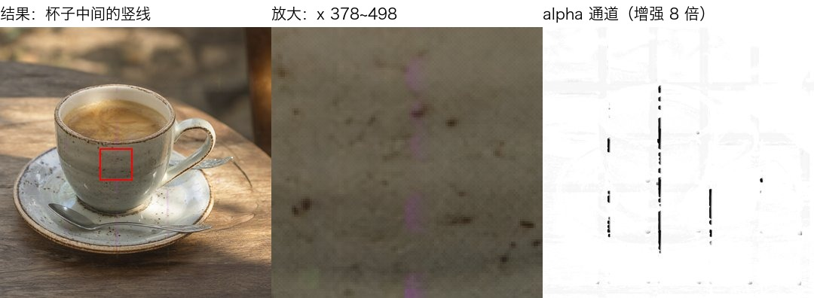

图 14（4090）：穿过杯子中央的粉色竖线（左侧红框，中间为放大）。右侧为 alpha 通道放大 8 倍后的样子，同一列可见接缝。

表 15：尝试改变的变量

| 变量 | 改变的值 | 结果 |
|---|---|---|
| seed | 42、7、1234、不指定 | 都出现在同一列 |
| 步数 | 20、40 | 同一列，深度相近 |
| CFG | 1.0、4 + negative prompt | 仍在同一列 |
| 设备 | DGX（aarch64）、4090（x86，offload） | 同一列 |
| 调用方式 | HTTP API、Web UI（gradio） | 得到同一张图 |
| 提示词 | 见下方表 16 | 强度不同 |

表 16：438 列附近 alpha 接缝的深度（0 为无，255 为完全透明）

| 图像 | 深度 | 外观 |
|---|---|---|
| 咖啡杯（seed 42·1234·不指定） | 13\~19 | 连续的粉色线 |
| Lookbook，垂坠上衣（seed 7·42，20·40 步） | 8.5\~10.0 | 穿过脸颊或胸前的粉色线 |
| Lookbook，针织开衫（seed 42，20·40 步） | 3.6\~5.4 | 脸颊和颈部的淡线 |
| 雨夜街道、咖啡馆招牌 | 0.7\~0.9 | 无 |

- upstream 已有同样症状的报告（[QwenLM/Qwen-Image-2.1 issue #5](https://github.com/QwenLM/Qwen-Image-2.1/issues/5)，"紫色竖条污迹"，尚无回复）。issue 作者称改变 VAE tiling、dtype 和解码方式后，竖线仍逐位相同，因此认为原因在解码器之前的阶段。
- 这与早期 Qwen-Image 起就已知的 2 像素间隔细网格是不同的缺陷。
- **人物脸上也会出现。** 在 2048×1152 的 Lookbook 中，同样在 438 列附近出现了线。图像宽度不同，列的位置却相同。几乎所有 Lookbook 都出现（表 16），穿过脸部的是 seed 42 的两张。

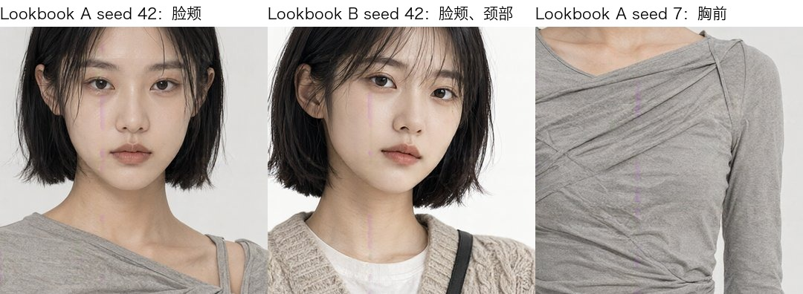

图 15（DGX）：三张 Lookbook 的同一列。左边两张穿过脸颊和颈部，右边一张穿过上衣胸前。

### 其他局限

- **即使不要求透明，也会混入半透明像素。** 输出总是 RGBA PNG，普通图像中也有约 2\~20% 的像素是半透明的。在保留 alpha 打开的场合（网页、编辑工具）可能会透出背景。
- **重用本模型生成图的 seed，结果会过饱和。** 参考图或要修的照片是本模型生成的时，用同一 seed、同一尺寸跑会过饱和地照搬输入；换 seed 或尺寸即可消失（3.2 节、3.4 节）。本报告的参考图和修图照片都是本模型生成的，所以没有确认相机拍的照片是否也会这样。
- 没有使用官方推荐的提示词改写模型（9B）。用单独蒙版文件指定的局部编辑无法测试：diffusers 的 2.1 管线没有蒙版输入，model-compose 的 inpaint 只支持 SDXL 和 FLUX。减少计算的 prefix KV cache 只在开启状态（diffusers 默认）下测量，效果未知。
- 没有与其他模型比较。本报告只看这一个模型能否在你的设备上运行、能做什么。
- 数值指标只用来辅助目视判定。韩文因为 OCR 会把写错的字读成原本的词，没有列出错误率；被划掉的词也会算成 0%。商品区域是目测裁切的。Lookbook 全身镜头中的脸太小，无法测人脸相似度。
- 判定由作者一人完成，样本量少：词句 21 条（海报；三种语言的手写感谢卡片、须知、笔记本和菜单卡；韩文须知改写的两条措辞；6 条短词句。只有短词句和中文须知各一张）、透明背景 6 例（5 种贴纸图案，其中一种用了两个 seed）、1 张参考图 10 例（5 个对象 × 2 个 seed），另有确认原因的重跑 12 例（同样对象再加 2 个 seed，女性换了另一张照片，以及 1152×896 两例）、多张参考图 12 例（3 张用 3 个 seed，10 张为原提示词 6 张加上修改提示词的 3 张）、修图 3 例、圆圈·涂色标记编辑 4 例、步数对比场景 3 个、Lookbook 提示词 2 个。正文表格只列出代表性的 seed。
- Mac 的结果来自第三方 4 位量化版。与原始权重的画质对比只有两张，且每项只跑一次，不清楚每次运行的耗时波动。修图和多张参考图未在 Mac 上测试。量化版同样适用原始权重的非商业许可。

## 许可证

| 对象 | 许可证 | 商业使用 |
| :---: | --- | :---: |
| 本服务 | [`LICENSE`](LICENSE) | ✓ |
| `Qwen/Qwen-Image-2.1` 权重 | [Qwen Research License](https://huggingface.co/Qwen/Qwen-Image-2.1/blob/main/LICENSE) | ✗ |
| `circulus/Qwen-Image-2.1-bnb-4bit`（Mac 用的 4 位版本） | 与原版相同的 Qwen Research License | ✗ |
